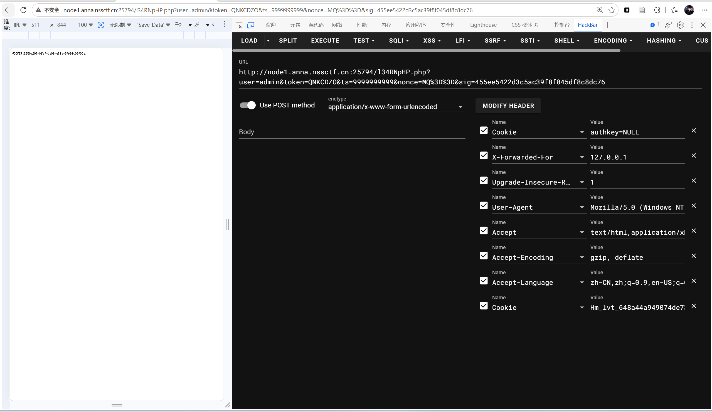

# Web
## PHP签到
- 打开环境，根据
```txt
想了解更多系统信息？机器人总是遵循特定的协议和规则...
```
联想到`robots.txt`并进入robots.txt，再进入`l34RNpHP.php`看到源码

```PHP
<?php

header('Content-Type: text/plain; charset=UTF-8');

if (!isset($_GET['user'], $_GET['token'], $_GET['sig'], $_GET['ts'], $_GET['nonce'])) {
    readfile(__FILE__);
    exit;
}

$user   = (string)$_GET['user'];
$token  = (string)$_GET['token'];
$sig    = (string)$_GET['sig'];
$ts     = (int)$_GET['ts'];
$nonce  = (string)$_GET['nonce'];

$xff = $_SERVER['HTTP_X_FORWARDED_FOR'] ?? '';
if (strpos($xff, '127.0.0.1') === false && strpos($xff, '::1') === false) {
    exit('hacker!');
}

if (base64_decode($nonce) === false || !preg_match('/^[A-Za-z0-9+\/=]+$/', $nonce)) {
    exit('hacker!!');
}

if (time() - $ts <= 60) {
    // ok
} else {
    exit('expired!');
}

if (strpos($user, 'admin') == false) {

    $key = $_COOKIE['authkey'] ?? 'NULL';
    $mac = hash_hmac('md5', $user . $token . $ts, $key);

    if (substr($mac, 0, 6) == substr($sig, 0, 6)) {

        $stored_hash = '0e830400451993494058024219903391'; 
        if (md5($token) == $stored_hash) {
            @readfile('/flag');
        } else {
            exit('hacker!!!');
        }

    } else {
        exit('hacker!!!!');
    }

} else {
    exit('blocked user');
}
```

1‍⃣
```php
$stored_hash = '0e830400451993494058024219903391'; 
 if (md5($token) == $stored_hash) {
     @readfile('/flag');
} else {
     exit('hacker!!!');
}
```

```txt
最终是要进入readfile('/flag')，必须要满足md5($token)==$stored_hash(php弱比较)
而在php弱比较中，0e830400451993494058024219903391 = 0 × 10^很多 = 0
所以md5(token)也长成”0e数字数字数字……"，经典值就是
QNKCDZO
所以token=QNKCDZO
```


</br>

2‍⃣
```php

$key = $_COOKIE['authkey'] ?? 'NULL';
$mac = hash_hmac('md5', $user . $token . $ts, $key);

if (substr($mac, 0, 6) == substr($sig, 0, 6)) {
```

```txt
外层是if (substr($mac, 0, 6) == substr($sig, 0, 6)) {，所以不仅要让token通过md5，还要让签名sig也通过
```

而对于mac
```php
$key = $_COOKIE['authkey'] ?? 'NULL';
$mac = hash_hmac('md5', $user . $token . $ts, $key);
```

- mac：明文为user+token+ts的拼接字符串；密钥为key；加密方式为hash_hmac——所以想要得到mac，还需要知道key user ts
- key：如果传了Cookie(比如Cookie:authkey=abc)，那么key就是Cookie，没有就是NULL；所以最简单的方法是不带authkey Cookie或者明确Cookie:authkey=NULL；这样key的值就是NULL

</br>

3‍⃣
```php
if (strpos($user, 'admin') == false) {
```
- strops为查找字符串，如果user='admin'，那么返回0(因为admin出现在第0位)
- 同时在PHP弱比较中0\==false，所以strpos($user, 'admin') == false返回true
- 所以user=admin


</br>

4‍⃣选ts
```php
if (time() - $ts <= 60) {
    // ok
} else {
    exit('expired!');
}
```
时间戳不能超过60秒，所以可以用当前时间戳
但是也可以传入未来时间戳
```txt
ts=9999999999
```
那么
```php
time() - $ts < 0
```
负数也小于0，所以也可以用ts=9999999999
**关键是：计算sig用的ts，必须和URL里传的ts一模一样**

</br>

5‍⃣
```php
if (base64_decode($nonce) === false || !preg_match('/^[A-Za-z0-9+\/=]+$/', $nonce)) {
    exit('hacker!!');
}
```
要求nonce是Base64的样子
所以随便给
```http
nonce=MQ==
```
（MQ\==解码后是1）

</br>

6‍⃣
```php
$xff = $_SERVER['HTTP_X_FORWARDED_FOR'] ?? '';
if (strpos($xff, '127.0.0.1') === false && strpos($xff, '::1') === false) {
    exit('hacker!');
}
```
所以抓包时加
```http
X-Forwarded-For:127.0.0.1
```



ps：真的很害怕读源码😭

---