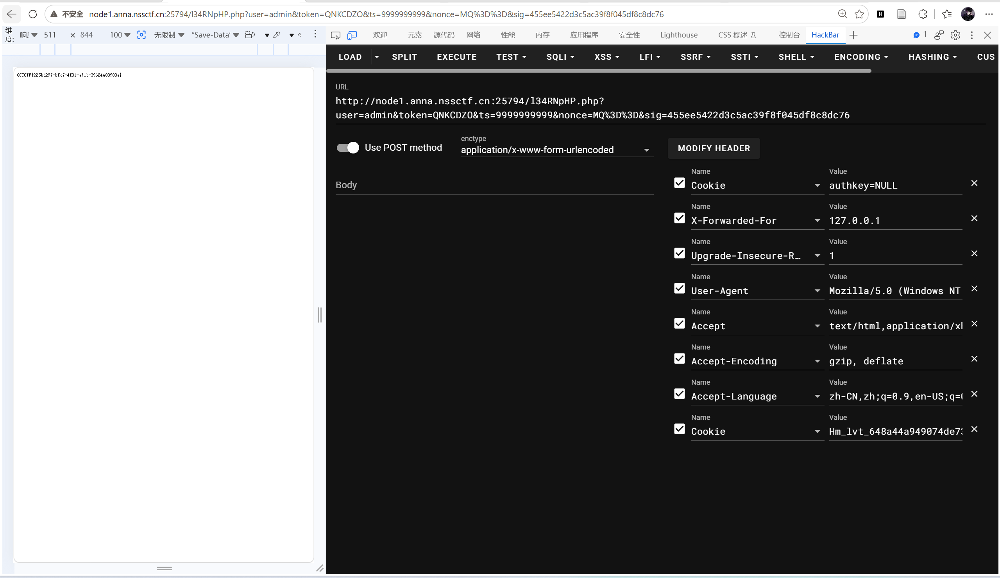
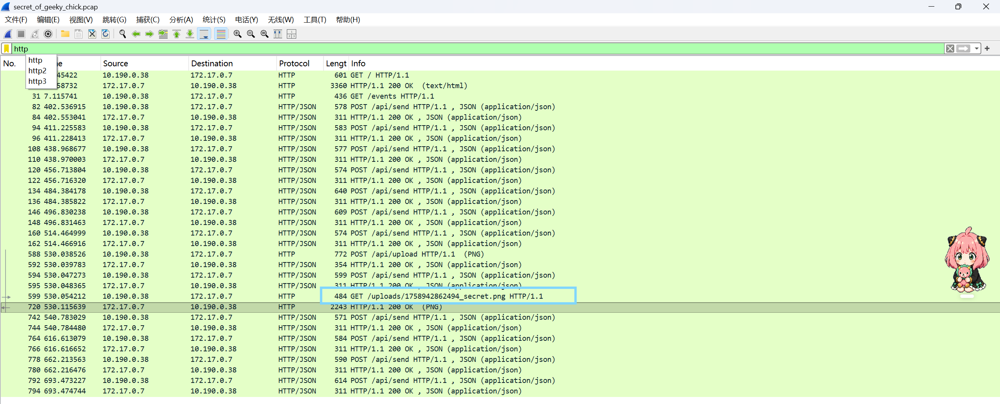
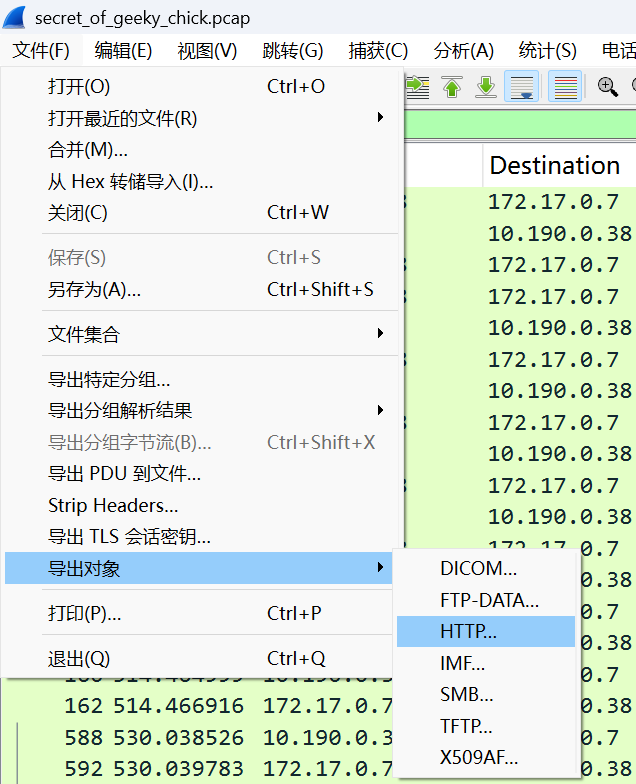
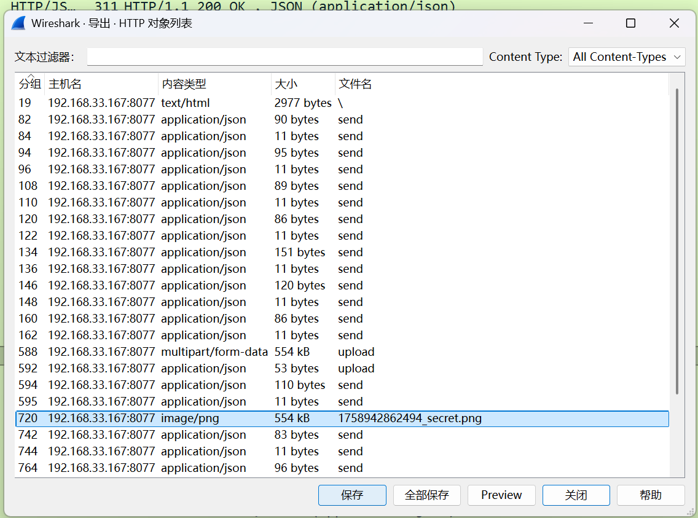
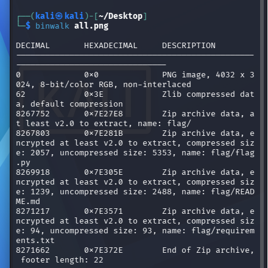
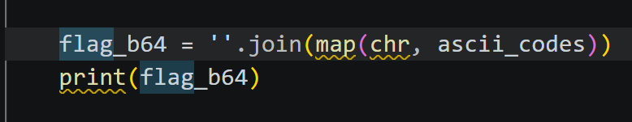
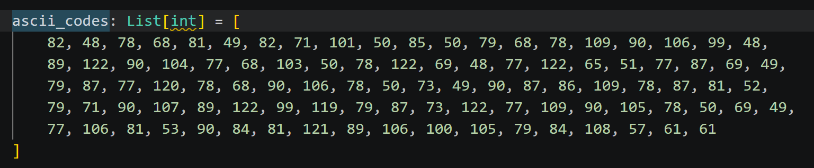

# Web
## PHP签到
- 打开环境，根据
```txt
想了解更多系统信息？机器人总是遵循特定的协议和规则...
```
联想到`robots.txt`并进入robots.txt，再进入`l34RNpHP.php`看到源码

```PHP
<?php

header('Content-Type: text/plain; charset=UTF-8');

if (!isset($_GET['user'], $_GET['token'], $_GET['sig'], $_GET['ts'], $_GET['nonce'])) {
    readfile(__FILE__);
    exit;
}

$user   = (string)$_GET['user'];
$token  = (string)$_GET['token'];
$sig    = (string)$_GET['sig'];
$ts     = (int)$_GET['ts'];
$nonce  = (string)$_GET['nonce'];

$xff = $_SERVER['HTTP_X_FORWARDED_FOR'] ?? '';
if (strpos($xff, '127.0.0.1') === false && strpos($xff, '::1') === false) {
    exit('hacker!');
}

if (base64_decode($nonce) === false || !preg_match('/^[A-Za-z0-9+\/=]+$/', $nonce)) {
    exit('hacker!!');
}

if (time() - $ts <= 60) {
    // ok
} else {
    exit('expired!');
}

if (strpos($user, 'admin') == false) {

    $key = $_COOKIE['authkey'] ?? 'NULL';
    $mac = hash_hmac('md5', $user . $token . $ts, $key);

    if (substr($mac, 0, 6) == substr($sig, 0, 6)) {

        $stored_hash = '0e830400451993494058024219903391'; 
        if (md5($token) == $stored_hash) {
            @readfile('/flag');
        } else {
            exit('hacker!!!');
        }

    } else {
        exit('hacker!!!!');
    }

} else {
    exit('blocked user');
}
```

1‍⃣
```php
$stored_hash = '0e830400451993494058024219903391'; 
 if (md5($token) == $stored_hash) {
     @readfile('/flag');
} else {
     exit('hacker!!!');
}
```

```txt
最终是要进入readfile('/flag')，必须要满足md5($token)==$stored_hash(php弱比较)
而在php弱比较中，0e830400451993494058024219903391 = 0 × 10^很多 = 0
所以md5(token)也长成”0e数字数字数字……"，经典值就是
QNKCDZO
所以token=QNKCDZO
```


</br>

2‍⃣
```php

$key = $_COOKIE['authkey'] ?? 'NULL';
$mac = hash_hmac('md5', $user . $token . $ts, $key);

if (substr($mac, 0, 6) == substr($sig, 0, 6)) {
```

```txt
外层是if (substr($mac, 0, 6) == substr($sig, 0, 6)) {，所以不仅要让token通过md5，还要让签名sig也通过
```

而对于mac
```php
$key = $_COOKIE['authkey'] ?? 'NULL';
$mac = hash_hmac('md5', $user . $token . $ts, $key);
```

- mac：明文为user+token+ts的拼接字符串；密钥为key；加密方式为hash_hmac——所以想要得到mac，还需要知道key user ts
- key：如果传了Cookie(比如Cookie:authkey=abc)，那么key就是Cookie，没有就是NULL；所以最简单的方法是不带authkey Cookie或者明确Cookie:authkey=NULL；这样key的值就是NULL

</br>

3‍⃣
```php
if (strpos($user, 'admin') == false) {
```
- strops为查找字符串，如果user='admin'，那么返回0(因为admin出现在第0位)
- 同时在PHP弱比较中0\==false，所以strpos($user, 'admin') == false返回true
- 所以user=admin


</br>

4‍⃣选ts
```php
if (time() - $ts <= 60) {
    // ok
} else {
    exit('expired!');
}
```
时间戳不能超过60秒，所以可以用当前时间戳
但是也可以传入未来时间戳
```txt
ts=9999999999
```
那么
```php
time() - $ts < 0
```
负数也小于0，所以也可以用ts=9999999999
**关键是：计算sig用的ts，必须和URL里传的ts一模一样**

</br>

5‍⃣
```php
if (base64_decode($nonce) === false || !preg_match('/^[A-Za-z0-9+\/=]+$/', $nonce)) {
    exit('hacker!!');
}
```
要求nonce是Base64的样子
所以随便给
```http
nonce=MQ==
```
（MQ\==解码后是1）

</br>

6‍⃣
```php
$xff = $_SERVER['HTTP_X_FORWARDED_FOR'] ?? '';
if (strpos($xff, '127.0.0.1') === false && strpos($xff, '::1') === false) {
    exit('hacker!');
}
```
所以抓包时加
```http
X-Forwarded-For:127.0.0.1
```



ps：真的很害怕读源码😭

--- 

# Misc
## 计小鸡的秘密
- 下载得到.pcap流量包，查看流量中的协议分布，发现有http协议，于是优先分析http协议

- 在其中发现一个流名称为`1758942862494_secret.png`，猜测flag在其中，于是导出http文件


- 查看导出的图片发现图片显示不正常，于是修改宽高为1024\*1024；得到正确的flag

---
## ezmisc
- 下载附件得到一张图片，将图片左上角的字符串给填入flag发现flag不对
- 用binwalk检查发现里面有附件，于是提取得到`7E27E8.zip`压缩包

- 压缩包解压需要密码，将图片左上角的字符串输入得到`flag.py`
- 打开flag.py看到很长的代码，先搜索`flag`，于是又返回去找`ascii_codes`


- 将ascii_codes转换成对应的ASCII字符拼接起来就是flag的Base64形式
```python
import base64
ascii_codes = [
        82, 48, 78, 68, 81, 49, 82, 71, 101, 50, 85, 50, 79, 68, 78, 109, 90, 106, 99, 48,
        89, 122, 90, 104, 77, 68, 103, 50, 78, 122, 69, 48, 77, 122, 65, 51, 77, 87, 69, 49,
        79, 87, 77, 120, 78, 68, 90, 106, 78, 50, 73, 49, 90, 87, 86, 109, 78, 87, 81, 52,
        79, 71, 90, 107, 89, 122, 99, 119, 79, 87, 73, 122, 77, 109, 90, 105, 78, 50, 69, 49,
        77, 106, 81, 53, 90, 84, 81, 121, 89, 106, 100, 105, 79, 84, 108, 57, 61, 61
]

result = ''.join(map(chr, ascii_codes))

print("Base64:")
print(result)

print("Flag:")
print(base64.b64decode(result).decode())
```

---
## eztalk
1. 题目描述中说
```txt
“多聊”
“想知道的都可以问他”
"同一个问问题可能会有不同的答案"
```
于是多次询问（5次）“给我flag” 得到第一段`flag：942726a4-`
![[Pasted image 20260903161341.png]]

<br>
2. 另外又说
```txt
"也许他会给你提示"
“聊天就能得到全部的flag？哪有这么容易！”
```
所以还要从别的地方得到flag，于是又问它“给我提示”得到如下提示：
```txt
没有登陆你是怎么进来的？
想知道flag具体怎么拼接吗？我很乐意告诉你答案的！
多看文档或许能了解更多呢。
我是不会告诉你我藏的四段flag都在什么地方的！
```
根据刚刚获得的提示猜测这个网站存在其他目录可以访问，于是用dirsearch扫描
![[Pasted image 20260910182925.png]]

<br>

3. 根据
```txt
没有登陆你是怎么进来的？
```
先进行登录。先随便输入用户名和密码显示“用户名错误”，多次尝试后使用admin显示“请输入8位密码”，于是又去ds搜索“CTF题目中没有提示的用户名为admin的常见8位登录密码”，尝---试到“admin123"时成功登录得到第二份flag：`-aa24-63d`
![[Pasted image 20260910183139.png]]![[Pasted image 20260910183152.png]]![[Pasted image 20260910183954.png]]
![[Pasted image 20260910183837.png]]

<br>

4.  根据
```txt
多看文档或许能了解更多呢。
```
于是访问`docs`，在“API接口文档”中看到获取特定图片信息的命令，于是挨个尝试
![[Pasted image 20260910184932.png]]
试到`/api/image/7`时发现
```txt
"is_flag":true,
```
于是下载该图片，用随波逐流的StegSolve LSB分析器得到第三段flag：`4071-4a01`

<br>

5. 另外还在文档的管理员控制面板处看到
![[Pasted image 20260910185747.png]]
于是使用SQLmap进行扫描得到最后一段flag：`4d8e01277`

<br>

6. 接下来进行拼接。在聊天界面询问拼接方法，尝试两次得到最终flag

