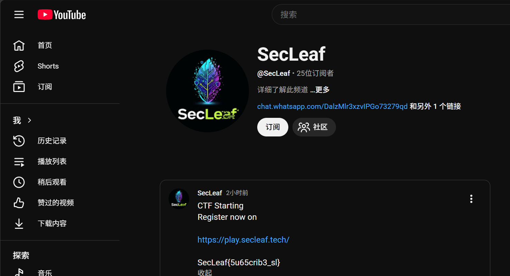
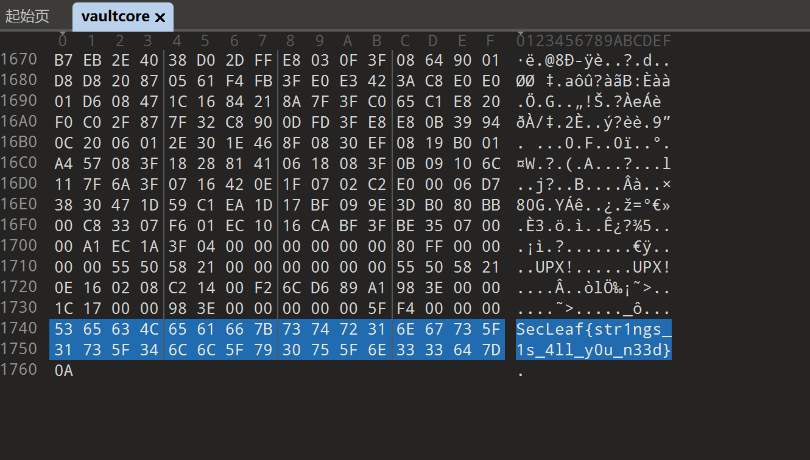
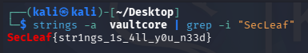
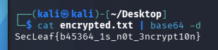
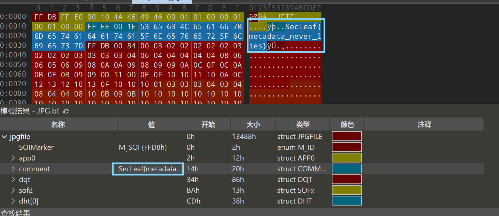
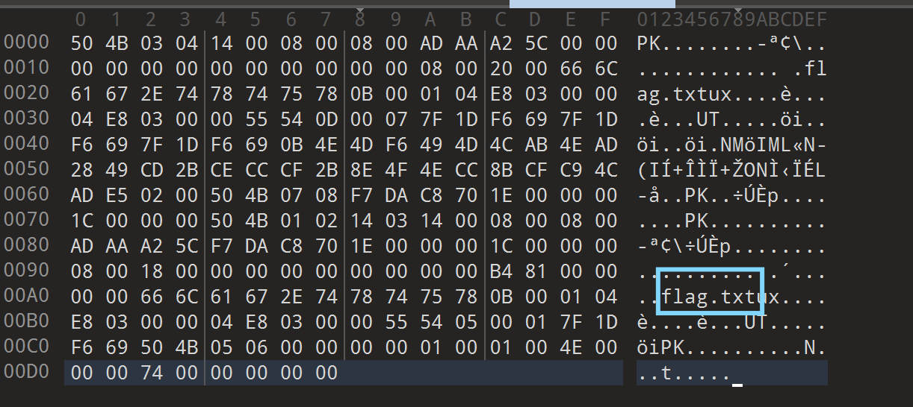
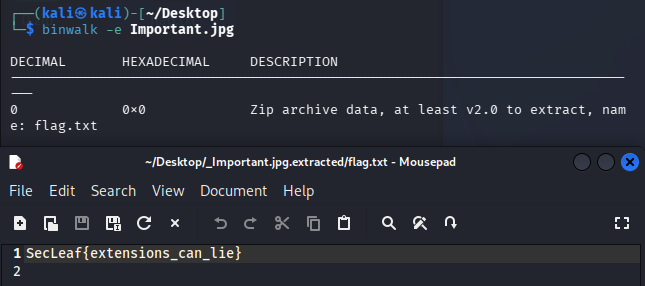

# `Misc`
## 1.`SanityCheck`（合理性检查）
### 题目描述
`Find the flag on our YT Channel` [https://www.youtube.com/@SecLeaf](https://www.youtube.com/@SecLeaf)

### 解题思路
打开链接发现是赛事通知，展开文章即可看到`flag`  

---

## 2.`vaultcore`
### 题目描述
```text
We recovered a protected vault executable from an abandoned workstation.

Initial analysis suggests:

anti-debugging routines
payload decryption
integrity verification
Can you recover the secure access token?

Flag format: SecLeaf{}

我们从一台废弃的工作站中恢复了一个受保护的保险库可执行文件。

初步分析表明：

反调试例程  
载荷解密  
完整性校验  

你能恢复安全访问令牌吗？
```

## 解题思路
附件下载后发现无法直接看出文件类型，于是用`010Editor`打开，在开头也没看出文件类型，拉到最后发现了`flag`~~瞎猫碰上死耗子~~  

也可以用
```bash
strings -a vaultcore | grep -i "SecLeaf"
```
输出得到`flag` 


---

## 3.`Digital Rockstar`
### 题目描述
```txt
Some programmers write code. Others write poetry.
Can you understand this digital rockstar?
> every space matters.also i is not i
Flag Format: SecLeaf{}

有些程序员编写代码，另一些则书写诗篇。
你能读懂这位“数字摇滚巨星”吗？
每一个空格都至关重要；此外，“i”亦非彼“i”。

```

### 解题思路

---

## 4.`The Invoice Incident`
### 题目描述
```txt
The Invoice Incident

At 09:14 AM, a finance employee reported receiving an urgent invoice email. Shortly after, suspicious activity began on the host.

You have been provided mail and endpoint logs collected during the incident.

Analyze the logs carefully, determine the malicious attachment responsible for the compromise, and submit the flag.

发票事件

上午 09:14，一名财务人员报告收到了一封紧急发票邮件。此后不久，主机上便出现了可疑活动。

您已获提供在此次事件期间收集的邮件日志及终端日志。

请仔细分析这些日志，找出导致系统沦陷的恶意附件，并提交 Flag。
```

### 解题思路
事件起点：`At 09:14 AM + receiving an urgent invoice email`，九点十四分收到邮件，所以先找`09：14`左右的邮件
```bash
grep -i "invoice" *
```

由此我们可以看出：
```txt
发件人：billing@micr0soft-support.com
收件人：finance.aarti
主题：Pending Invoice Notice
附件：Invoice_April_2026.docm
```
初步判定这个就是可疑邮件

> 1‍⃣该邮件与题目十分吻合；  
> 2‍⃣发件人十分可疑——**发件人邮箱**中`microsoft`的`o`被替换成`0`；  
> 3‍⃣附件很可疑——附件为`.docm`格式，攻击者经常把恶意命令藏在宏里

但是这样并不能完全确定，所以接下来查看`endpoint`日志（电脑行为日志）

由日志可以看出：`09：16`时确实打开了`Invoice_April_2026.docm`文件，而紧接着启动了`powershell`并连接了`198.51.100.24:80`
```txt
PowerShell 是 Windows 上执行命令的工具。攻击者很喜欢用它下载恶意程序、执行脚本、连接远程服务器。
-enc 通常表示命令是 Base64 编码过的 PowerShell 命令。攻击者经常这样做，是为了让命令看起来不明显。
```

由以上信息我们可以判断，`Invoice_April_2026.docm`是导致可疑行为的恶意附件
```txt
SecLeaf{Invoice_April_2026.docm}
```

---

# `Cryptography`
## 1.`military_grade_encryption`
### 题目描述
附件下载后为`txt`文本，内容：
```txt
U2VjTGVhZntiNDUzNjRfMXNfbjB0XzNuY3J5cHQxMG59
```

### 解题思路
看起来比较像`Base64`编码，解码后得到`flag`
```bash
cat encrypted.txt | base64 -d
```


---

# `OSINT`
## `Can_you_Find_Cafe`
### 题目描述

```txt
A single image holds all the clues you need. Study the surroundings carefully and identify the exact location where it was taken. Accuracy matters.

Use "_" instead of spaces.

Flag Format: SecLeaf{Name_of_the_place+Location_name}
```

### 解题思路
用谷歌识图，选择 **“外观匹配”** 

第一篇文章打开后得到这间咖啡店的简介

根据内容即可得到`flag`
```txt
SecLeaf{Cafe_Goodluck+Deccan_Gymkhana}
```

---

# `Forensics`
## 1.`Forgotten_snapshot`
### 题目描述
```txt
We recovered this image from a damaged backup archive.

Analysts believe the original owner attempted to conceal sensitive information before deletion.

Some image data may have survived recovery.

Flag format: SecLeaf{}


我们从损坏的备份存档中恢复了此镜像。

分析人员认为，原所有者在删除前试图隐藏敏感信息。

部分镜像数据可能在恢复后仍然存在。
```

### 解题思路

附件左下角有个网址，但在浏览器上搜索后并没有成功搜索出来
于是用`010`打开，很容易就找到了`flag`


---

## 2.`Important`
### 题目描述
```txt
A suspicious image file was recovered during investigation. It appears harmless, but appearances can be misleading.

Inspect the file carefully, determine its true format, and recover the hidden flag.

File Provided: important.jpg

Flag Format: SecLeaf{}

调查过程中发现一个可疑的图像文件。它看似无害，但表象往往具有欺骗性。

请仔细检查该文件，确定其真实格式，并恢复隐藏的标志。
```

### 解题思路
`jpg`附件无法直接用看图工具打开，于是用`010`查看

发现了`flag.txt`，于是`binwalk`分离得到`txt`文件
```bash
binwalk -e Important.jpg
```


---

## 3.`Force-push-wont-save-you`
### 题目描述
```txt
A developer force-pushed several times before the repository was archived.

We suspect sensitive data may still exist somewhere in the project history.

Some objects may no longer be referenced.

Flag format: SecLeaf{}

在代码库归档之前，一位开发者多次强制推送了代码。

我们怀疑项目历史记录中可能仍然存在敏感数据。

某些对象可能已不再被引用。
```

### 解题思路
1‍⃣**先将附件解压并查看里面包含的文件**
```bash
unzip challenge.zip
cd force-push-wont-save-you
ls -la
```

解压后由`.git`，同时又结合题目
>`force-pushed several times`    
>`project history`   
>`objects may no longer be referenced`      

所以我们除了看当前文件，还要看`Git`历史与`Git`对象

2‍⃣**先看当前文件**
```bash
cat app.js
```

由
```txt
TODO REMOVE HARDCODED TOKEN
```
我们可以看出以前可能真的提交过敏感信息，但后来被删除了——所以继续查历史

3‍⃣**查询所有能看到的提交历史**
```bsah
git log --oneline --all --decorate --graph
```

从`"remove sensitive file before push"`推测有删除，于是查看
```bash
git show 0fbc9b5:.env 
```

所以这个不是真正的`flag`

或者也可以直接在所有正常历史里搜索`flag`
```bash
git grep -n "SecLeaf" $(git rev-list --all)
```

也不是真正的`flag`

4‍⃣**根据题目说的“Some objects may no longer be referenced”，所以查 dangling objects**
```bash
git fsck --full --no-reflogs --lost-found
```

分别查看`commit`与`blob`

但是这两个也是假的`flag`。到这里发现题目在故意引导只查`Git`历史与`dangling objects`，但这些都是假的

5‍⃣**继续全局搜索整个目录**
因为前面找到的全是假的`flag`，所以应该扩大范围
```bash
grep -RIn --binary-files=text "SecLeaf" .
```


---
## 4.`needle_in_context`
### 题目描述
```txt
During a failed forensic recovery attempt, several debug logs were partially reconstructed.

Investigators believe some entries may still contain fragments of sensitive data.

Be warned: not every recovery artifact is trustworthy.

Flag format: SecLeaf{}

在一次失败的取证恢复尝试中，部分调试日志被成功重建。

调查人员认为，某些日志条目可能仍然包含敏感数据片段。

请注意：并非所有恢复产物都可信。
```

### 解题思路


---

# 碎碎念
这场比赛应该是我参加的第一场有效比赛。为什么是有效呢？因为之前也参加过几场`CTF`比赛，但那时一是在寒假（我游戏瘾最大的一段时间），二是那时还停留在`DeepSeek`（也没有说`ds`不好用的意思），参与度就仅限于报名了。
报名这场比赛时我只是想着给我的周末“找事干”，同时还没有用`GPT`打过比赛，另外还有在过去大半年也断断续续学了点（真的只有一点），想着检测一下学习成果。有点不好意思的是，比赛刚开始时除了签到题我是自己做的外，其他题目都是直接用`AI`梭（虽然这后来看了下其中很多题也差不多属于签到题，连我这样的水平也能一眼看到解题思路）。“二战转折点”在`Can_you_Find_Cafe`出来后，我已经从最开始打比赛时追求排名的激情转向了“得把梭出来的题自己做一遍”，于是就尝试了一下那道社工题。

（这是我们队成绩最好的一次了）

---
这次收获还是挺大的，至少有好几道题目之前一直没有尝试，这次得到了有效反馈
- `The Invoice Incident`
- `Can_you_Find_Cafe`
- `Force-push-wont-save-you`
