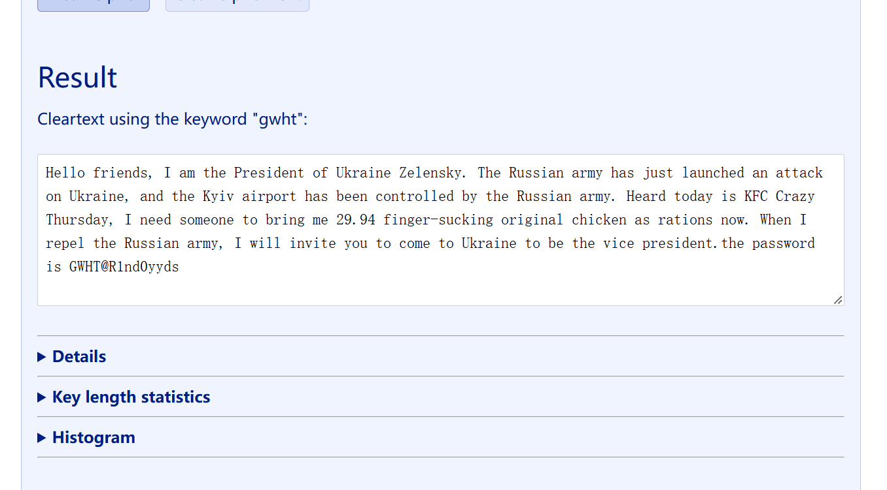

# 9.1
[[羊城杯 2022]where_is_secret - NSSCTF](https://www.nssctf.cn/problem/2582)
用维吉尼亚密码破解器破解得出密钥为`gwht`，压缩包密码为`GWHT@R1nd0yyds`

同时提示也给了加密脚本，根据脚本得出解密脚本
```python
#!/usr/bin/env python3
"""Decode the BMP produced by the supplied encode() function.

The encoder stores one Unicode code point per RGB pixel:
    R = 0, G = codepoint >> 8, B = codepoint & 0xff
The decoder below uses only Python's standard library and handles the
bottom-up row order used by a normal BMP file.
"""

import argparse
from pathlib import Path
import re
import struct


def decode_bmp(image_path: Path) -> str:
    data = image_path.read_bytes()
    if data[:2] != b"BM":
        raise ValueError("not a BMP file")

    pixel_offset = struct.unpack_from("<I", data, 10)[0]
    width, height = struct.unpack_from("<ii", data, 18)
    bits_per_pixel = struct.unpack_from("<H", data, 28)[0]
    compression = struct.unpack_from("<I", data, 30)[0]
    if width <= 0 or height == 0 or bits_per_pixel != 24 or compression != 0:
        raise ValueError("expected an uncompressed 24-bit BMP")

    row_stride = ((width * 3 + 3) // 4) * 4
    row_indices = range(height - 1, -1, -1) if height > 0 else range(-height)
    decoded = []
    for row_index in row_indices:
        row_start = pixel_offset + row_index * row_stride
        for x in range(width):
            blue, green, _red = data[row_start + 3 * x : row_start + 3 * x + 3]
            codepoint = (green << 8) | blue
            decoded.append(chr(codepoint) if codepoint else "\0")
    # The square image is padded with black pixels after the source text.
    return "".join(decoded).rstrip("\0")


def _is_cjk(ch: str) -> bool:
    return "\u4e00" <= ch <= "\u9fff"


def _number_bounds(text: str, index: int) -> tuple[int, int]:
    start = index
    while start and text[start - 1].isdigit():
        start -= 1
    end = index + 1
    while end < len(text) and text[end].isdigit():
        end += 1
    return start, end


def _is_normal_number(text: str, start: int, end: int) -> bool:
    """Ignore ordinary ages/quantities in the book, such as 16岁 or 500个."""
    before = text[start - 1] if start else ""
    after = text[end] if end < len(text) else ""
    units = "岁年个月天周时分钟秒英尺毛钱个%"
    return before == "第" or after in units or after in "前后左右"


def extract_suspicious(text: str) -> tuple[str, str]:
    """Extract ASCII characters anomalously inserted into Chinese prose.

    The challenge text contains legitimate English in parentheses and ordinary
    numbers.  Remove parenthetical notes, then retain ASCII characters that
    touch Chinese text (plus braces/underscores).  Normal number expressions
    are discarded.  The returned report keeps context for manual verification.
    """
    cleaned = re.sub(r"\([^()\r\n]*\)", "", text)
    candidates: list[tuple[int, str]] = []

    for index, ch in enumerate(cleaned):
        if ch in "{}_":
            candidates.append((index, ch))
            continue
        if not ch.isascii() or not (ch.isalpha() or ch.isdigit()):
            continue

        left = cleaned[index - 1] if index else ""
        right = cleaned[index + 1] if index + 1 < len(cleaned) else ""
        if ch.isdigit():
            start, end = _number_bounds(cleaned, index)
            if _is_normal_number(cleaned, start, end) and "_" not in cleaned[max(0, start - 1) : end + 1]:
                continue
        if _is_cjk(left) or _is_cjk(right):
            candidates.append((index, ch))

    # One hidden letter is on a line by itself, so it has no CJK neighbour.
    known = {index for index, _ in candidates}
    for match in re.finditer(r"(?m)^\s*([A-Za-z])\s*$", cleaned):
        index = match.start(1)
        if index not in known:
            candidates.append((index, match.group(1)))
    candidates.sort()

    flag_candidate = "".join(ch for _, ch in candidates)
    report = "\n".join(
        f"{index:6}: {ch!r}  {cleaned[max(0, index - 18) : index + 19]!r}"
        for index, ch in candidates
    )
    return flag_candidate, report


def main() -> None:
    parser = argparse.ArgumentParser()
    parser.add_argument(
        "input",
        type=Path,
        help="encoded out.bmp or an already decoded decoded.txt",
    )
    parser.add_argument("-o", "--output", type=Path, help="save decoded text")
    parser.add_argument(
        "--extract",
        action="store_true",
        help="extract suspicious characters from the decoded Chinese text",
    )
    parser.add_argument(
        "--report",
        type=Path,
        help="save suspicious characters and their surrounding context",
    )
    args = parser.parse_args()

    if args.input.suffix.lower() in {".txt", ".text"}:
        text = args.input.read_text(encoding="utf-8")
    else:
        text = decode_bmp(args.input)
    if args.output:
        args.output.write_text(text, encoding="utf-8")
    if args.extract or args.report:
        candidate, report = extract_suspicious(text)
        if args.extract:
            print(candidate)
        if args.report:
            args.report.write_text(report + "\n", encoding="utf-8")
    elif not args.output:
        print(text, end="")


if __name__ == "__main__":
    main()

```
运行
```powershell
py -3 solve_where_is_secret.py decoded.txt --extract --report suspicious_report.txt
```
得到flag
