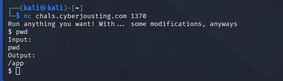
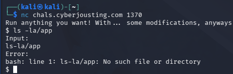
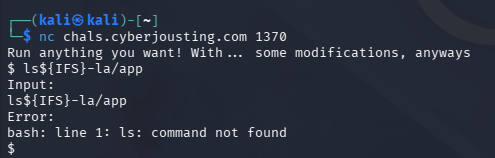
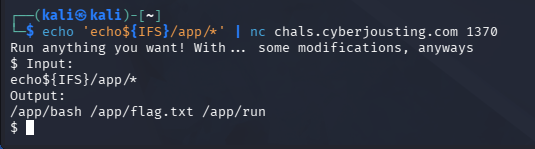
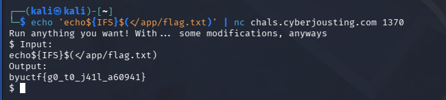
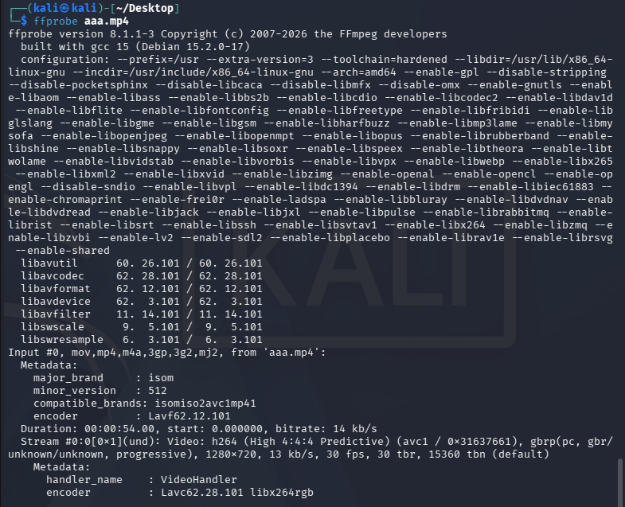

# `Misc`
## `1.Inception`
### 题目描述
```txt
I found this weird file on my computer. I tried opening it, but there were some problems.
```

### 解题思路
1‍⃣首先对附件进行检查
附件为`png`图片，所以复制附件并添上后缀，得到第一部分的`flag`
```txt
byuctf{wh4t_
```
2‍⃣同时用`binwalk`检查并提取隐藏内容
提取出来的有：
```txt
4F3 4F3.zlib
29 29.zlib
337.zip data.bin
```
分别读取各附件得到`flag`
```txt
从data.bin得到flag的第二部分
	th3
从4F3中得到第三部分
	_fr3ak}
```
最终`flag`为
```txt
byuctf{wh4t_th3_fr3ak}
```

---
## `2.Easy`
### 题目描述
```txt
Okay, easy mode is turned on. You know how to use bash, right?

chals.cyberjousting.com:1370
```

### 解题思路
1‍⃣首先使用`nc`连接题目服务
输入`pwd`测试当前目录

根据返回结果得知当前工作目录在`/app`
2‍⃣发现过滤规则
尝试查看当前目录文件，但根据返回的报错可以看出：题目服务会删除命令中的空格

3‍⃣绕过空格过滤
用`${IFS}`代替空格使用

但还是会报错：说明不能直接使用普通外部命令
4‍⃣使用 `bash` 内置功能列目录



---
## `3.Chromatic`
### 题目描述
```txt
（一份mp4文件）
```

### 解题思路
先检查`mp4`文件

根据
```txt
30 fps
54 秒
```
可以看出是一秒一张图片，同时看视频内容可以猜测：每一秒的红色数值，正好能转成一个字符。
#### `EXP`
```python
import subprocess
import collections

video = "chromatic.mp4"

# 取视频左上角 1x1 像素，每帧输出 RGB
cmd = [
    "ffmpeg",
    "-v", "error",
    "-i", video,
    "-vf", "crop=1:1:0:0,format=rgb24",
    "-f", "rawvideo",
    "-"
]

data = subprocess.check_output(cmd)

# 每帧 3 个字节：R G B
r_values = [data[i] for i in range(0, len(data), 3)]

fps = 30
flag = ""

# 每 30 帧，也就是每 1 秒取一次
for i in range(0, len(r_values), fps):
    block = r_values[i:i+fps]

    # 取这一秒出现最多的红色值
    r = collections.Counter(block).most_common(1)[0][0]

    # 红色值转 ASCII 字符
    flag += chr(r)

print(flag)
```

---


● CTF 入门教学：Bash 越狱挑战

  第一步：理解你在攻击什么

  先看看我们连接上去后看到了什么：

  Welcome to my new bash, sbash, the Safe Bourne Again Shell!
  There's a script in the local directory you can run for the flag...
  safe_bash>

  这是一个受限的 Shell（类似监狱，所以叫 jail）。它让你输入命令，但有很多限制。

  ---
  第二步：读懂限制规则

  题目附件 jail.sh 就是限制规则的源代码。我们逐条翻译：

  export PATH="/tmp"         # ① PATH 被改了，系统命令（ls, cat）都用不了
  cd /ctf/19*               # ② 当前目录是一个秘密名字的文件夹

  然后每次你输入命令，会经过四重检查：

  检查一：黑名单字符（第 17 行）

  不能有这些字符：> < ; & $ ( } ` 空格 \t \v \f \r " * . , =

  检查二：长度限制（第 20 行）

  输入不能超过 20 个字符

  检查三：ASCII 检查（第 22 行）

  不能有非 ASCII 字符（这个其实有 bug，会报错但不影响）

  检查四：小写字母检查（第 24 行）

  不能有小写字母 [a-z]

  如果全部通过，你的输入会被 eval 执行。

  ---
  第三步：盘点我们还有什么

  所有限制过滤掉的东西，反选一下就得到可用字符清单：

  ┌──────────┬─────────────────────────────────┐
  │   类别   │            可用字符             │
  ├──────────┼─────────────────────────────────┤
  │ 数字     │ 0-9                             │
  ├──────────┼─────────────────────────────────┤
  │ 大写字母 │ A-Z                             │
  ├──────────┼─────────────────────────────────┤
  │ 路径     │ /                               │
  ├──────────┼─────────────────────────────────┤
  │ 通配符   │ ?（注意：* 被禁了，. 也被禁了） │
  ├──────────┼─────────────────────────────────┤
  │ 括号     │ [ ]                             │
  ├──────────┼─────────────────────────────────┤
  │ 其他符号 │ ~ + - _ ! # % ^ : @ ' \ " | {   │
  └──────────┴─────────────────────────────────┘

  关键发现：
  - ~ 可以用 — 这在 bash 里代表 HOME 目录，而 ~+ 代表当前工作目录！
  - ? 可以用 — 它也是通配符，匹配恰好一个任意字符
  - / 可以用 — 路径分隔符

  ---
  第四步：核心思路

  我们的目标是：执行当前目录下的 flag 脚本。

  正常做法是 ./脚本名，但这需要用到：
  - . → 被禁了
  - 脚本名 → 很可能是小写字母 → 被禁了

  突破一：如何表示"当前目录"？

  不能用 .，也打不开 $PWD（$ 被禁了），但可以用：
  ~+
  在 bash 中，~+ 展开后就是当前目录的绝对路径。比如：
  echo ~+    # 输出 /ctf/19ecae731566ee058943b0ac569ea9ef/
  完全不包含任何被禁字符！

  突破二：如何匹配脚本文件名？

  我们不能直接打字（小写被禁），也不能用 * 通配（被禁），但可以用 ?。

  ? 匹配恰好 1 个字符。只要猜对文件名的长度即可。

  ---
  第五步：探测文件名长度

  ~+/???       # 匹配 3 字符名 → 失败，没有这样的文件
  ~+/????      # 匹配 4 字符名 → 失败
  ~+/?????     # 匹配 5 字符名 → 失败
  ~+/??????    # 匹配 6 字符名 → 失败
  ~+/???????   # 匹配 7 字符名 → 触发了 jail.sh！（jail.sh 正好 7 字符）
  ~+/????????  # 匹配 8 字符名 → 🎉 得到了 flag！

  jail.sh 是 7 个字符，flag 脚本是 8 个字符。所以 ???????? 精准命中了 flag 脚本。

  ---
  第六步：执行

  最终 payload：

  ~+/????????

  也就是 11 个字符，全部通过检查，eval 执行时：

  eval "~+/????????"
     ↓ tilde 展开
  eval "/ctf/19ecae731566ee058943b0ac569ea9ef/????????"
     ↓ glob 展开（假设脚本叫 get_flag）
  eval "/ctf/19ecae731566ee058943b0ac569ea9ef/get_flag"
     ↓ 执行脚本
  🏁 byuctf{funky_bu1lt1n_j1uj1tsu_ba8c3e44}

  ---
  总结：解题思维导图

  目标：执行一个不知道名字的脚本
          │
          ├─ 当前目录怎么表示？
          │   ├─ .  ❌ 被过滤
          │   ├─ $PWD ❌ $被过滤
          │   └─ ~+ ✅ 展开后就是当前目录的绝对路径
          │
          ├─ 脚本文件怎么匹配？
          │   ├─ 打字  ❌ 小写被过滤
          │   ├─ *    ❌ 被过滤
          │   └─ ?    ✅ 逐长度穷举（恰好8字符命中）
          │
          └─ 拼在一起 → ~+/???????? = 11字符 ✅ 通过全部检查

  给小白的关键启发

  1. 先看源码，手工画出"能用的"和"不能用的"，不要凭感觉
  2. 一个功能有多种写法，比如"当前目录":
    - . → 被禁
    - $PWD → $ 被禁
    - ~+ → 可用！
  3. 逐字符长度匹配 是在 * 被禁时的好替代
  4. CTF 题的本质就是：在限制条件下，找到设计者没想到的替代方案

✻ Cooked for 28s

※ recap: 这道 bash 越狱 CTF 题已经做完了。用 `~+/????????`（11字符）绕过了所有过滤拿到
  flag：`byuctf{funky_bu1lt1n_j1uj1tsu_ba8c3e44}`。上一轮已给了完整的入门级解题教学，没有需要继续的步骤。 (disable
  recaps in /config)