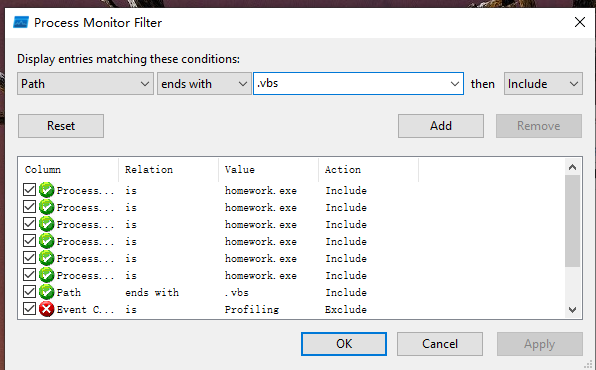
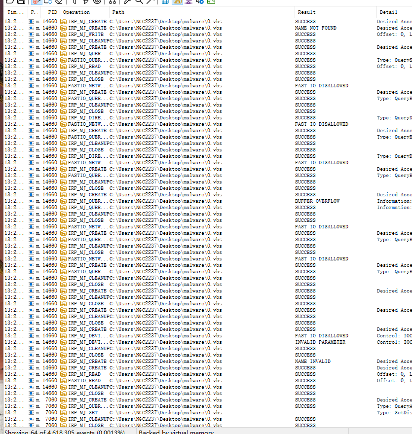
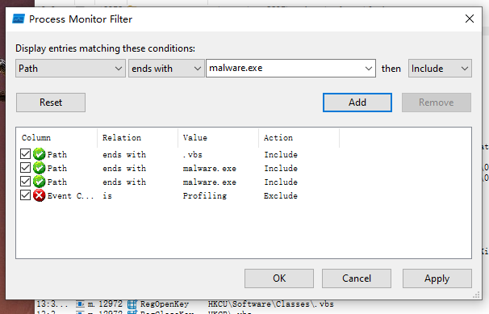
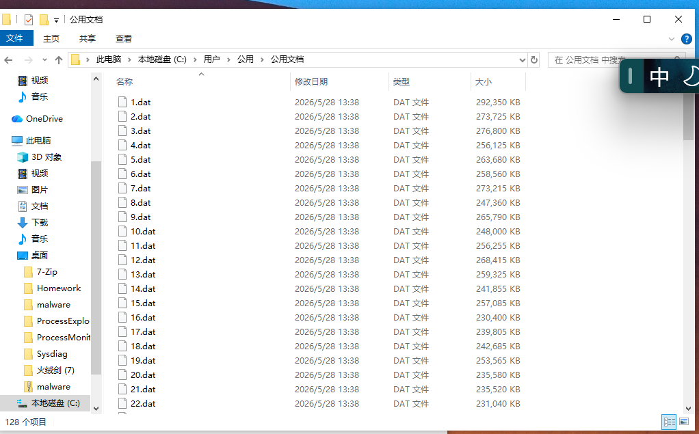

# 配置虚拟机
## 准备
- `VMware Workstation Pro`
- `Ubuntu`的`iso`文件——[Ubuntu 22.04.5 LTS (Jammy Jellyfish)](https://releases.ubuntu.com/jammy/)
- `Windows10`的`iso`文件——[下载 Windows 10](https://www.microsoft.com/zh-cn/software-download/windows10)
---

## 安装Ubuntu
- 打开`VMware`，选择`"Create a New Virtual Machine"`
- 选择`"Typical"`安装 -> `next`
- 在`"Installer disc image file(iso):"`处选择下载好的`iso`文件 -> `next `
- 设置账号以及硬件配置等基本操作
- 开机后进入安装界面
- `Installl Ubuntu` -> 语言：`English` ，键盘：`English` -> `Minimal installaation`并勾选：
	- ✔ Download updates while installing
	- ✔ Install third-party software
- 安装类型为：`Erase disk and install Ubuntu`
 - ## 配置代理
- `settings` -> `Network` -> `Network Proxy` -> `Manual`

---
## 安装`Windows10`
- 基本安装
	- 打开`VMware`，选择`"Create a New Virtual Machine"`
	- 选择`"Typical"`安装 -> `next`  -> 选择下载好的`iso`文件
	- 设置账号以及硬件配置等基本操作
	- 开机后进入安装界面
- 配置代理同上
- 安装客机增强件：
	- `VM -> install VMware Tools -> 点击“此电脑”中的盘片 -> 下载相关文件`
	- 右下角显示出`VM Tools`即为安装成功
- 共享文件
	- 先点击`VMware`顶部菜单的`VM`,选择`Settings...`
	- 在弹出的设置窗口中点击`Options`选项卡
	- 找到并点击`Shared Folders`，文件夹的共享状态为`Always enabled`
	- 点击下方的`Add`添加，不要勾选`Read-only`
	- 将共享文件夹映射为网络驱动器
		- 打开虚拟机的“此电脑”；
		- 在顶部菜单栏找到“映射网络驱动器”
		- 将共享文件夹的地址填入其中
- 快照
	- 创建快照
		- 将虚拟机开机
		- 先点击`VMware`顶部菜单的`VM`,选择`Snapshot -> take Snapshot`
		- 在弹出的页面中输入快照名称与描述
	- 恢复快照
		- 在相同的页面点击`Reserve to Snapshot ...`即可
- 迁移

---

# 注册表
- 打开方式
	- 快捷键`Win + R`打开运行窗口，输入`regedit`并在弹出的对话框中选择允许
- 五个**根节点**
	- **`HKEY_CLASSES_ROOT`**：存储各类不同文件扩展名对应的默认打开程序
	- **`HKEY_CURRENT_USER`**：当前用户的配置数据信息
	- **`HKEY_LOCAL_MACHINE`**：硬件、计算机所有用户的配置数据信息
	- **`HKEY_USERS`**：计算机默认用户的配置文件和已知用户的配置文件的子项
	- **`HKEY_CURRENT_CONFIG`**：当前硬件配置信息

---

# 进程行为分析报告
## 1‍⃣下载软件
- 在畅课平台中将需要的软件下载并拖到虚拟机中
- 主要包括
	-  `homework.zip`
	- `ProcessMonitor.zip`
	- `ProcessExplorer.zip`
## 2‍⃣实验过程
- 对`zip`文件进行解压
- 启动`ProcessMonitor`   

- 在`Process Monitor`中添加过滤条件（`CTRL+L`），使其只显示`homework.exe`相关操作记录，条件添加成功后，**点击 `Apply`**   

- 此时我们会看见后面显示为空白，是因为还没有运行`homework.exe`程序
- 接下来我们需要运行`.exe`程序
	- 打开`powershell`并`cd`到文件所在目录
	- ```bash
	   .\homework.exe 202512063055
	  ```

- 因为已知目标文件为`jpg`文件，所以进一步缩小范围
	- `CTRL+F`进行查找，然后复制文件地址，打开即可得到图片   

# 杀毒作业
## 实验准备
1‍⃣**先将实验所需的材料下载到虚拟机上**
- `ProcessMonitor`
- `7-zip`
- 火绒剑
- 病毒样本

2‍⃣**先对虚拟机进行一个快照，方便恢复备份**


3‍⃣**关闭虚拟机的网络连接**，避免恶意程序运行过程中与外部环境继续通信。

同时还需要断开
```txt
共享文件夹
共享粘贴板
拖放
```
---
## 实验过程
###  **分析病毒行为**
1‍⃣用`Process Monitor`分析 

- 病毒需要解压并输入密码`"iqiqiya"`
- 运行病毒后生成一个`0.vbs`脚本

- 病毒运行时间太久了，已经无法打开`powershell`
- 在`Process Monitor`中终止进程，试图打开火绒剑但是失败了


2‍⃣**虚拟机关机并恢复到杀毒前**
- 先把火绒剑打开并关闭杀毒软件；按刚才操作再操作一遍
- 病毒运行后，找到火绒剑的进程，找到最上面的`malware.exe`，右键，“结束进程树”，再等一段时间后就能成功结束病毒
- 结束进程后刷新磁盘空间，可以看到 `C` 盘空间不再继续减少，说明恶意程序的持续写入行为已经被阻止。

---
## **程序行为分析**
1‍⃣首先新增过滤条件，观察恶意程序是否生成脚本文件

在过滤结果中可以找到`.vbs`文件的相关路径

进一步查看单条记录可以看到该文件的具体路径

2‍⃣接着增加过滤条件来查看程序自身的进程活动


通过过滤结果可以发现，`malware.exe`会创建大量子进程，这是其恶意行为的重要特征之一
```txt
恶意程序的行为：
- 生成 .vbs 脚本文件
- 创建大量子进程
- 持续写入 .dat 文件挤占C盘空间
```

---
## 查杀过程
- 首先删除恶意程序本身
- 随后在`ProcessMonitor`中定位到一个`.dat`文件，右键、`Jump To`跳转到对应目录并删除该文件夹下所有的`.dat`文件

- 清理完成后可以看到磁盘空间已恢复到接近实验前的状态，说明本次杀毒工作完成


# 随便记记
- 这里主要记录一些小且杂的问题
## 虚拟机网络排查
- 某次启动虚拟机的时候发现虚拟机没有联网，检查虚拟机设置：`NAT` 连接方式没有问题、主机网络也没有问题——可以检查是否为`**VMware NAT**服务挂掉`——在主机上`Win + R`  ->  `services.msc`；找到`VMware NAT Service`与`VMware DHCP Service`，确保二者“正在运行”